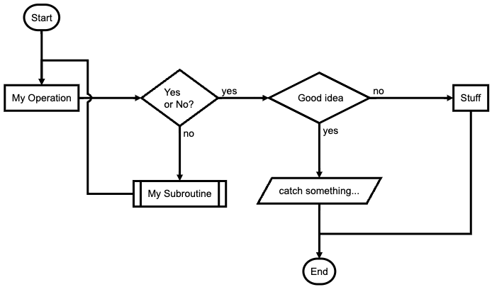

# Building Components

You can build components to encapsulate additional functionality implemented in Javascript
by subclassing one of the Component implementations.

New component implementations often load external Javascript libraries and create interfaces
to Javascript objects configured using the external libraries.
The new component may also provide additional special methods that allow the gizmo which
uses the component to interact with the Javascript functionality. 


The following 
<a href="./flowchart.py">
flowchart visualization implementation 
</a>
illustrates how to 
build a new gizmo component using an existing Javascript library.
See the discussion below the code listing and the screen shot for
an explanation of the techniques used.

```Python
# contents of ./flowchart.py
"""
A flow chart visualizer.
Based on an example contributed by https://github.com/psychemedia.
"""

from H5Gizmos import jQueryComponent, do, serve
import asyncio

class FlowChart(jQueryComponent):

    def __init__(self, flowchart_description, width="500", height="300"):
        super().__init__(init_text="flowchart should appear here.")
        self.description = flowchart_description
        self.width = width
        self.height = height

    def add_dependencies(self, gizmo):
        super().add_dependencies(gizmo)
        # Load the libraries for the flowchart implementation.
        self.remote_js("https://cdnjs.cloudflare.com/ajax/libs/raphael/2.3.0/raphael.min.js")
        self.remote_js("https://flowchart.js.org/flowchart-latest.js")
        # Connect the 'flowchart' global javascript object to 'gizmo.flowchart'
        self.initial_reference("flowchart")

    def configure_jQuery_element(self, element):
        super().configure_jQuery_element(element)
        self.resize(self.width, self.height)
        # Parse the description.
        self.chart = self.cache("chart", self.gizmo.flowchart.parse(self.description))

    def draw(self, *ignored):
        # Draw into the DOM object contained in the jQuery element: self.element[0]
        # Clear out temporary placeholder text.
        do(self.element.empty())
        do(self.chart.drawSVG(self.element[0]))

# === Example script usage below

example_description = """
st=>start: Start|past:>http://www.google.com[blank]
e=>end: End|future:>http://www.google.com
op1=>operation: My Operation|past
op2=>operation: Stuff|current
sub1=>subroutine: My Subroutine|invalid
cond=>condition: Yes
or No?|approved:>http://www.google.com
c2=>condition: Good idea|rejected
io=>inputoutput: catch something...|future

st->op1(right)->cond
cond(yes, right)->c2
cond(no)->sub1(left)->op1
c2(yes)->io->e
c2(no)->op2->e
"""

async def example_task():
    chart = FlowChart(example_description)
    # Hack around a library defect -- flowchart.js seems to need a delay before drawing the chart.
    await chart.show()
    # wait a little bit...
    await asyncio.sleep(0.2)
    chart.draw()

if __name__ == "__main__":
    serve(example_task())
```

When run as a script at the command line this visualization appears in a new browser frame:



## Discussion

This implementation is a subclass of the standard `jQueryComponent`
which overrides methods to load the `flowchart` javascript libraries
and to define how to configure the flowchart.

### `H5Gizmos.jQueryComponent`

The components described in this documentation are subclasses
of `jQueryComponent`.  All running `jQueryComponent` instances are associated
with a jQuery container object in the child Javascript context,
adorned with many useful methods and features provided by `jQuery` and `jQueryUI`
libraries.

The `FlowChart` implementation must specify how to load the functionality
to draw a flowchart and how to use this functionality with the jQuery
container object.

### `component.add_dependancies`

The `add_dependancies` method must specify any static configuration
required by the component implementation.  In this case the method
instructs the gizmo to load two javascript libraries statically and
to make a reference to the global `flowchart` javascript object
available from the parent process as `gizmo.flowchart`.

### `component.initial_reference`

The `initial_reference` method establishes a static reference
to a Javascript object in the parent and child processes.

### "View source" to examine static configuration

To examine or debug the static gizmo configuration it is useful to "view source"
on the gizmo tab.  In this case the
HTML source generated for the gizmo frame shows the following declarations that
reflect the component configuration:

```html
<script src="https://cdnjs.cloudflare.com/ajax/libs/raphael/2.3.0/raphael.min.js"></script>
<script src="https://flowchart.js.org/flowchart-latest.js"></script>
...
<script>
...
        tr.set_reference('flowchart', flowchart);
...
</script>
```

Examining the frame source also provides the experienced Javascript programmer
some good hints about data structures in the Javascript child process to explore during
debugging using the browser developer tools.

### `component.configure_jQuery_element`

The `configure_jQuery_element` method must prepare the jQuery
component for use in the application.  In this case we `cache`
a reference to a `flowchart` object in the child and keep a reference
to the cached object as `self.chart`.  For some reason (maybe a race
condition) drawing the flowchart immediately doesn't work, so
we provide a separate `draw` method so the flowchart will draw after
a short delay.

### `asyncio.sleep`

The `example_task` creates the `FlowChart` component `chart` and starts the
component using `chart.show()`.  
The start procedure executes `configure_jQuery_element` automatically,
configuring the chart.

After the component starts `example_task`
waits a moment to avoid the draw anomaly mentioned above
by allowing the chart to initialize before the draw using
`asyncio.sleep()`.  It is important to use `asyncio.sleep()` instead of
`time.sleep()` here because `time.sleep()` would block all communication
between the parent and the child processes, so the anomaly would be delayed
but not avoided.

## Some external examples

It may be useful to examine some other examples of gizmo
component implementations.  In addition to those available
in the H5Gizmos source code please have a look at the following.

### `jp_doodle dual_canvas`

The `jp_doodle` repository includes an `H5Gizmo` wrapper implementation
<a href="https://github.com/AaronWatters/jp_doodle/blob/master/jp_doodle/gz_doodle.py">
https://github.com/AaronWatters/jp_doodle/blob/master/jp_doodle/gz_doodle.py
</a> which embeds a `dual_canvas` in a gizmo container for drawing geometric diagrams.

### `feedWeGL2` isosurface viewer

The `feedWebGL2` repository wraps a three dimensional isosurface viewer as an H5Gizmo component:
<a href="https://github.com/AaronWatters/feedWebGL2/blob/master/feedWebGL2/volume_gizmo.py">
https://github.com/AaronWatters/feedWebGL2/blob/master/feedWebGL2/volume_gizmo.py</a>.

<a href="./README.md">
Return to Component categories.
</a>
