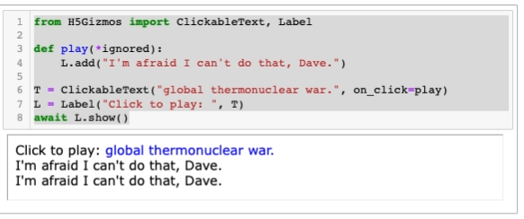
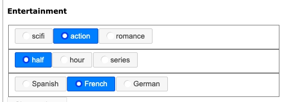
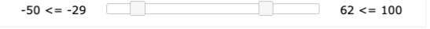
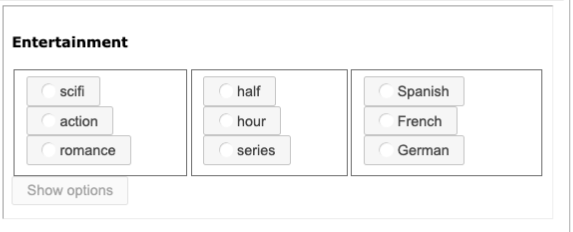
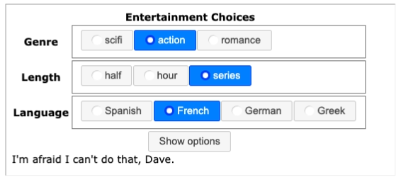

# Composite Gizmo Components

Composite components such as `Template`s and `Stack`s build structures that include other components.
This document illustrates
and explains the use of some composite components.
The example code is embedded in the
<a href="./Demo%20Composite%20Components.ipynb">
Demo Composite Components.ipynb</a>
Jupyter notebook in this folder.

## `Label`

A `Label` associates an explanatory text with another component.
The label is displayed and can be interpreted by screen readers for
people with vision difficulties.  The following code fragment
associates a label with a clickable text.

```Python
from H5Gizmos import ClickableText, Label

def play(*ignored):
    L.add("I'm afraid I can't do that, Dave.")
    
T = ClickableText("global thermonuclear war.", on_click=play)
L = Label("Click to play: ", T)
await L.show()
```



## `Stack`

A `Stack` arranges a sequence of child components in a vertical sequence.
The following code arranges a header, three radio buttons, and push button
vertically.

```Python
from H5Gizmos import Html, RadioButtons, Button, Stack

title = Html("<h4>Entertainment</h4>")
genre = RadioButtons("scifi action romance".split())
duration = RadioButtons("half hour series".split())
language = RadioButtons("Spanish French German".split())
show_options = Button("Show options")

S = Stack(
    children=[
        title,
        genre, 
        duration, 
        language, 
        show_options]
)
await S.show()
```

The `S.attach_children(list)` replaces the child components for a `Stack` or a `Shelf`
dynamically.




## `Shelf`

```Python
from H5Gizmos import RangeSlider, Text, Shelf

low_text = Text("low")
low_text.resize(width=150).css({"text-align": "center"})
hi_text = Text("high")
hi_text.resize(width=150).css({"text-align": "center"})

def r_slide_callback(*ignored):
    low = RS.low_value
    high = RS.high_value
    low_text.text(" %s <= %s " % (m, low))
    hi_text.text(" %s <= %s " % (high, M))

m = -50
M = 100
d = 30
RS = RangeSlider(
    minimum=m,
    maximum=M,
    low_value=m+d,
    high_value=M-d,
    step=1,
    on_change=r_slide_callback,
)
RS.resize(width=300)

S = Shelf(
    children=[low_text, RS, hi_text]
)

await S.show()
```



## Implicit `Shelf` inside a `Stack`

```Python
from H5Gizmos import Html, RadioButtons, Button, Stack

genre = RadioButtons("scifi action romance".split())
duration = RadioButtons("half hour series".split())
language = RadioButtons("Spanish French German".split())
show_options = Button("Show options")

S = Stack(
    children=[
        "<h4>Entertainment</h4>", 
        [genre, duration, language], 
        show_options]
)
await S.show()
```



## `Template`

```Python
from H5Gizmos import RadioButtons, Button, Template

genre = RadioButtons("scifi action romance".split())
duration = RadioButtons("half hour series".split())
language = RadioButtons("Spanish French German Greek".split())
show_options = Button("Show options")

T = (Template("""
<table>
<tr> <th colspan="2">Entertainment Choices</th> </tr>
<tr>
    <th> Genre </th>
    <td> <div class="GENRE"/> </td>
</tr>
<tr>
    <th> Length </th>
    <td> <div class="DURATION"/> </td>
</tr>
<tr>
    <th> Language </th>
    <td> <div class="LANGUAGE"/> </td>
</tr>
<tr> <th colspan="2"> <div class="SHOW_OPTIONS"/> </th> </tr>
</table>
""").put(genre, "GENRE")
    .put(duration, "DURATION")
    .put(language, "LANGUAGE")
    .put(show_options, "SHOW_OPTIONS")
    )

await T.show()

def show(*ignored):
    T.add("I'm afraid I can't do that, Dave.")
    
show_options.set_on_click(show)
```



<a href="./README.md">
Return to Component categories.
</a>
