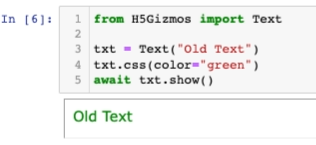
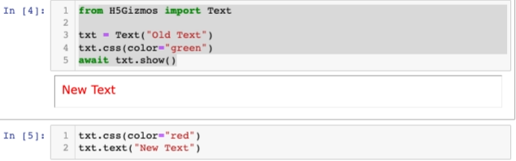
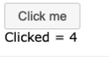
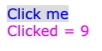
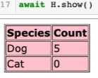
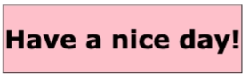

# Simple Gizmo Components

Simple components such as buttons and text do not contain other non-trivial components.

## `Text`

Initially

```Python
from H5Gizmos import Text

txt = Text("Old Text")
txt.css(color="green")
await txt.show()
```



Changed

```Python
txt.css(color="red")
txt.text("New Text")
```



## `Button`

```Python
from H5Gizmos import Button

count = 0

def button_click_callback(*ignored):
    global count
    count += 1
    info.text("Clicked = " + str(count))
    
B = Button("Click me", on_click=button_click_callback)
await B.show()
info = B.add("No clicks yet")
```




## `ClickableText`

```Python
from H5Gizmos import ClickableText

count = 0

def text_click_callback(*ignored):
    global count
    count += 1
    CTinfo.text("Clicked = " + str(count))
    CTinfo.css(color="magenta")
    
CT = ClickableText("Click me", on_click=text_click_callback)
await CT.show()
CTinfo = CT.add("No clicks yet")
```



## `Html`

```Python
from H5Gizmos import Html

H = Html("""
<table border>
    <tr>
        <th> Species </th> <th> Count </th>
    </tr>
    <tr>
        <td> Dog </td> <td> 5 </td>
    </tr>
    <tr>
        <td> Cat </td> <td> 0 </td>
    </tr>
</table>
""")
H.css({"background-color": "pink"})
await H.show()
```



```Python
H.html("<h1>Have a nice day!</h1>")
```


## `Input`


## `LabelledInput`

## `Slider`

## `RangeSlider`

## `DropDownSelect`

## `RadioButtons`

## `CheckBoxes`

## `Image`

## `Plotter`

<a href="./README.md">
Return to Component categories.
</a>
