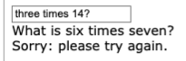
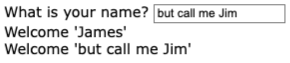
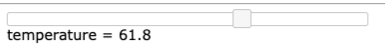
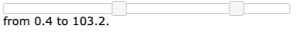
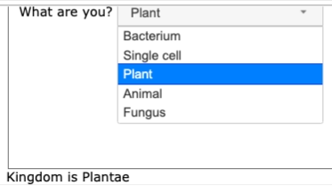
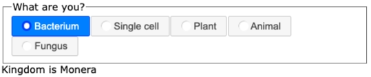
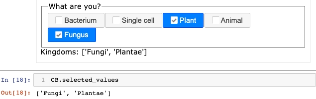
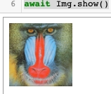
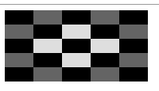
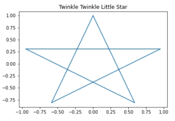

# Simple Gizmo Components

Simple components such as buttons and text do not contain other non-trivial components.
This document illustrates
and explains the use of some simple components.
The example code is embedded in the
<a href="./Demo%20Simple%20Components.ipynb">
Demo Simple Components.ipynb</a>
Jupyter notebook in this folder.

## `Text`

The text component displays a fragment of text
which can be updated after initialization.
For example the code below displays "Old text"
in an embedded frame when run in a Jupyter notebook
The `txt.css(color="green")` method call sets the CSS
text color style for the component to green.

```Python
from H5Gizmos import Text

txt = Text("Old Text")
txt.css(color="green")
await txt.show()
```


The code in the Jupyter notebook cell that follows
modifies the text to "Old text" with text color red.

```Python
txt.css(color="red")
txt.text("New Text")
```


## `Button`

The user can trigger the execution of a
Python "callback" function by clicking on a `Button`
component.  The code fragment below creates a button
that updates a counter display when the button is clicked.

```Python
from H5Gizmos import Button

count = 0

def button_click_callback(*ignored):
    global count
    count += 1
    info.text("Clicked = " + str(count))
    
B = Button("Click me", on_click=button_click_callback)
await B.show()
info = B.add("No clicks yet")
```

Here the `info=B.add("No clicks yet")` method call appends a text
area for displaying the count after the button.
The callback changes the text of the `info` text when
the user clicks the button.


The callback function receives an `event` object argument
which can sometimes be useful for special purposes, but
it is often not used in applications.

A button with no `on_click` callback (or an `on_click` of `None`)
will be disabled and shown greyed out.
Set or change
the callback for a button using the `B.set_on_click(callback)`
method.

## `ClickableText`

The user can also trigger a callback action by clicking
a `ClickableText` component.  The following example
demonstrates how to use a `ClickableText` element to update
a counter.

```Python
from H5Gizmos import ClickableText

count = 0

def text_click_callback(*ignored):
    global count
    count += 1
    CTinfo.text("Clicked = " + str(count))
    CTinfo.css(color="magenta")
    
CT = ClickableText("Click me", on_click=text_click_callback)
await CT.show()
CTinfo = CT.add("No clicks yet")
```


## `Html`

The `Html` component displays an HTML tag text
which may contain other tags.  The example below
displays a `table` tag with a header row and two data rows.

```Python
from H5Gizmos import Html

H = Html("""
<table border>
    <tr>
        <th> Species </th> <th> Count </th>
    </tr>
    <tr>
        <td> Dog </td> <td> 5 </td>
    </tr>
    <tr>
        <td> Cat </td> <td> 0 </td>
    </tr>
</table>
""")
H.css({"background-color": "pink"})
await H.show()
```


The `H.html("...")` method changes the displayed tag content.

```Python
H.html("<h1>Have a nice day!</h1>")
```


## `Input`

The `Input` component displays a text input field.
The example below shows an `Input`
named `answer` with two text areas
appended.  
The `answer.focus()` method sets the keyboard focus
to the `answer` input element.
The `answer.on_enter(check)` method
sets up the `check` callback to handle the `enter` event
for the `answer` input element.  The `check` function
checks to see whether the user entered the right value
after the user hits the enter key.

```Python
from H5Gizmos import Input

answer = Input(initial_value="-11")
await answer.show()
answer.add("What is six times seven?")
feedback = answer.add("Enter your answer in the box above, please.")
answer.focus()

def check(*ignored):
    entered = answer.value
    try:
        assert int(entered) == 6 * 7
    except Exception:
        feedback.text("Sorry: please try again.")
        answer.focus()
    else:
        feedback.text("Right!")
        
answer.on_enter(check)
```



## `LabelledInput`

The `LabelledInput` convenience wraps an `Input` in a `Label`
component to associate a text prompt with the `Input`.

```Python
from H5Gizmos import LabelledInput

LI = LabelledInput("What is your name? ")
await LI.label_container.show()

def on_response(*ignored):
    name = LI.value
    LI.label_container.add("Welcome " + repr(name))
    
LI.on_enter(on_response)
LI.focus()
```



Note that we do not `show` the `LI` component directly, but instead
use the label wrapper `LI.label_container.show()`.


## `Slider`

```Python
from H5Gizmos import Slider

def slide_callback(*ignored):
    v = S.value
    info.text("temperature = " + str(v))
    
S = Slider(
    minimum=-100,
    maximum=150.0,
    value=88.6,
    step=0.2,
    orientation="horizontal", # or "vertical"
    on_change=slide_callback,
)
S.resize(width=400)
await S.show()
info = S.add("temperature here...")
slide_callback()
```



## `RangeSlider`

```Python
from H5Gizmos import RangeSlider

def r_slide_callback(*ignored):
    low = RS.low_value
    high = RS.high_value
    rinfo.text("from %s to %s." % (low, high))
    
RS = RangeSlider(
    minimum=-100,
    maximum=150.0,
    low_value=23.4,
    high_value=88.6,
    step=0.2,
    orientation="horizontal", # or "vertical"
    on_change=r_slide_callback,
)
RS.resize(width=400)
await RS.show()
rinfo = RS.add("temperature here...")
r_slide_callback()
```



## `DropDownSelect`

```Python
from H5Gizmos import DropDownSelect

pairs = [
    ("Bacterium", "Monera"),
    ("Single cell", "Protista"),
    ("Plant", "Plantae"),
    ("Animal", "Animalia"),
    ("Fungus", "Fungi"),
]

def dropdown_callback(*ignored):
    [kingdom_name] = D.selected_values
    kingdom.text("Kingdom is " + kingdom_name)

D = DropDownSelect(
    label_value_pairs = pairs,
    selected_value="Fungi",
    legend="What are you? ",
)
D.resize(height=200)

await D.show()
kingdom = D.add("Kingdom here.")
dropdown_callback()
```




## `RadioButtons`

```Python
from H5Gizmos import RadioButtons

pairs = [
    ("Bacterium", "Monera"),
    ("Single cell", "Protista"),
    ("Plant", "Plantae"),
    ("Animal", "Animalia"),
    ("Fungus", "Fungi"),
]

def radio_callback(*ignored):
    [kingdom_name] = RD.selected_values
    rkingdom.text("Kingdom is " + kingdom_name)

RD = RadioButtons(
    label_value_pairs = pairs,
    selected_value="Fungi",
    legend="What are you? ",
    on_click=radio_callback,
)

await RD.show()
rkingdom = RD.add("Kingdom here.")
radio_callback()
```



## `CheckBoxes`

```Python
from H5Gizmos import CheckBoxes

pairs = [
    ("Bacterium", "Monera"),
    ("Single cell", "Protista"),
    ("Plant", "Plantae"),
    ("Animal", "Animalia"),
    ("Fungus", "Fungi"),
]

def check_callback(*ignored):
    names = CB.selected_values
    cbkingdom.text("Kingdoms: " + repr(names))

CB = CheckBoxes(
    label_value_pairs = pairs,
    selected_values=["Fungi", "Plantae"],
    legend="What are you? ",
    on_click=check_callback,
)

await CB.show()
cbkingdom = CB.add("Kingdom here.")
check_callback()
```



## `Image`

```Python
from H5Gizmos import Image

fn = "mandrill.png"
mandrill_bytes = open(fn, "rb").read()
Img = Image(fn, bytes_content=mandrill_bytes, height=100, width=100)
await Img.show()
```



### Loading an array into a blank image

```Python
Blank = Image(height=100, width=200)
await Blank.show()
```

then later

```Python
import numpy as np
A = np.zeros((25,), dtype=np.ubyte) + 222
B = A.reshape((5,5))
B[4,:] = B[0,:] = B[:,4] = B[:,0] = 100
A[::2] = 0
Blank.change_array(B)
Blank.css({"image-rendering": "pixelated"})
```



## `Plotter`

`Plotter` components serve as context managers for capturing
and displaying images from a `matplotlib` plot or from other
libraries based on `matplotlib`.

In the example below the `plot_region` component displays
the result of plotting a star shape using `matplotlib`.

```Python
from H5Gizmos import Plotter
import matplotlib.pyplot as plt

plot_region = Plotter()

await plot_region.show()
```

then

```Python
import numpy as np
import matplotlib.pyplot as plt

theta = 6 * np.pi / 5
xs = [ np.sin(theta * i) for i in range(6) ]
ys = [ np.cos(theta * i) for i in range(6) ]

with plot_region:
    plt.plot(xs, ys)
    plt.title("Twinkle Twinkle Little Star")
```

The result looks like this:



Aso please see the 
<a href="../Tutorials/hello_curves.md">
hello curves
</a> tutorial for a detailed example usage of the `add_pyplot`
which creates a `Plotter`.

<a href="./README.md">
Return to Component categories.
</a>
