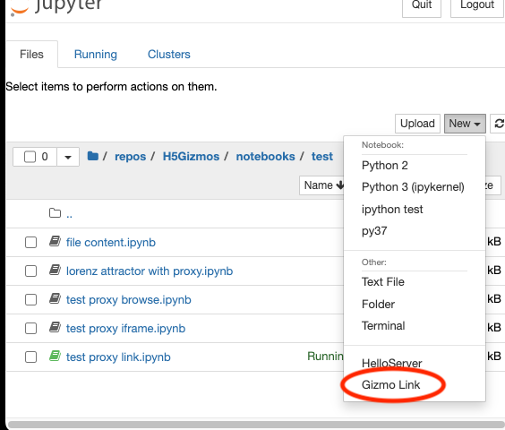

# The Gizmo Link Proxy Server

This section discusses the `GizmoLink` proxy server which helps user web browsers
display Gizmo user interfaces where the parent process runs on a remote machine.
The GizmoLink proxy server is primarily designed to function as a Jupyter proxy server
plugin, but it may be useful in other contexts also.

## Why proxy?

Gizmos provide graphical front end "child" interfaces that run in web browsers which are controlled
by "parent" processes.  The "child" and the "parent" can run on the same machine, or they can
run on different machines -- for example a "child" user interface running on my laptop in New York can be
controlled by a "parent" process running on a remote computer cluster in San Diego.

When a Gizmo script runs locally on my laptop, the parent process advertises and "entry URL"
that looks similar to this
```
http://localhost:61952/gizmo/http/MGR_1654722075274_2/index.html 
```
A web browser, also running on my laptop, can access this entry URL to start up the Gizmo
user interface and subsequent interactions between the parent and child transfer other
resource data using HTTP on my laptop (the localhost) over port 61952.

However, a resource locator (URL) like that one 
is not usually directly accessible to browsers running on remote machines, noteably because the URL uses
an arbitrary high numbered port (in this run it happens to be 61952) using an insecure protocol.  Consequently an attempt to use that URL in a browser running on my laptop
will fail if the parent process is running on a remote server.

The H5Gizmos methodology includes a proxy server implementation which connects gizmo
parent processes to well known ports which can in turn be mapped to secure access points.
The secure access point can connect parent processes to child contexts running in different
internet locations.

For example in the public Binder service the following secure HTTP link uses a GizmoLink
proxy server to launch a Gizmo parent process running on a host somewhere in the Google cloud service.
```
https://mybinder.org/v2/gh/AaronWatters/H5Gizmos/HEAD?urlpath=GizmoLink%3Fmodule%3DH5Gizmos%26script%3DLorenz_Attractor
```
Once the parent process starts the proxy server redirects the browser to the following
"proxy start page"
```
https://notebooks.gesis.org/binder/jupyter/user/aaronwatters-h5gizmos-dyp789mu/GizmoLink/connect/32973/gizmo/http/MGR_1654781140336_3/index.html
```
An access to the this URL is connected by the proxy server on the host machine to the local URL
```
http://localhost:32973/gizmo/http/MGR_1654781140336_3/index.html
```
which is the internal "start page" for the parent process, which starts the Gizmo
user interface.

# GizmoLink as a Jupyter Proxy Server Plugin

When `H5Gizmos` is installed in a Python environment that launches a Jupyter server,
the GizmoLink proxy server will appear as a launch option in the Jupyter user interface.
In "classic notebook" the launch option looks like this:



The start page for the GizmoLink server lists Python modules with configured 
<a href="./Scripts.md">
Gizmo script entry points.  
</a>
A Gizmo script entry point can be started from the server pages by clicking
on the script name link.

# Configuring Jupyter notebooks and terminals to use GizmoLink

Gizmo interfaces started inside a Jupyter notebook will use the GizmoLink proxy server
if and only if the notebook has been configured to use the server.

To configure a notebook to use the GizmoLink server add a cell like this to the top of
the notebook

```Python
from H5Gizmos import use_proxy
await use_proxy()
```

## The `GIZMO_LINK_PREFIX` environment variable for Jupyter terminals

In a Jupyter notebook
the `use_proxy` output area lists a Bash environment variable declaration similar to this
```
export GIZMO_LINK_PREFIX=http://127.0.0.1:8888/GizmoLink/
```
Paste the similar declaration into Jupyter terminals to configure the terminal shell
to use the proxy server for any Gizmo scripts launched from the Jupyter terminal.

Whenever the `GIZMO_LINK_PREFIX` environment variable is defined for a gizmo parent
process when the process starts
the process will advertize URLs constructed to use the proxy prefix
and will display a link for the `browse` method instead of starting the
web browser frame automatically.

## Sniffing the environment with `use_proxy_if_remote`

The proxy server adds some overhead and delays to data transfers between the
parent process and the child front end interface.  For gizmos with large or frequent
data transfers it may improve performance to avoid using the proxy when possible.

The following notebook cell code configures a Jupyter notebook to use the proxy
server only if the environment appears to be running under Binder or Jupyter Hub.

```Python
from H5Gizmos import use_proxy_if_remote
await use_proxy_if_remote()
```
The environment test will not correctly detect
the need for the proxy in all remote environments (for example running
using `repo2docker` outside of Binder).


## Running the proxy server from the command line

For testing and debugging (and possibly for other uses) the `GizmoLink` proxy
server may be started using the shell command `gizmo_link` of form
```bash
$ gizmo_link port base_url prefix
```
For example
```bash
$ gizmo_link 9876 / GizmoLink
```
Use this command to verify that <a href="./Scripts.md">Gizmo script entry points.  
</a> work properly in the server interface, for example.


<a href="./README.md">
Return to Gizmo Scripts and the GizmoLink Proxy Server.
</a>