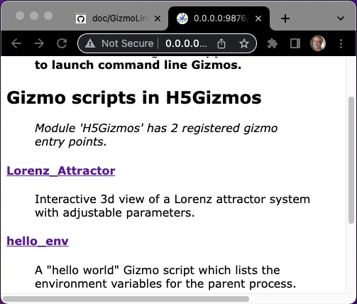

# Gizmo script entry points

A Python package may advertise H5Gizmo script entry points to publish gizmo
based user interfaces.  
H5Gizmo script entry points advertise Gizmo scripts designed to be launched by the Gizmo Link proxy server in a subprocess.
These entry points may be discovered and launched from the command line
or using the GizmoLink proxy server interface.

## Trivial example entry point

An H5Gizmo script entry point should identify a Python function
that starts an H5Gizmo parent process which requires no standard input
or command line arguments.

The `H5Gizmos/python/scripts/hello_env.py` listed below is included in
the `H5Gizmos` package to illustrate the mechanics of creating Gizmo entry points.

<a href="https://github.com/AaronWatters/H5Gizmos/blob/main/H5Gizmos/python/scripts/hello_env.py">
Content of hello_env.py</a>

```Python
from H5Gizmos import Html, serve
import os

def main():
    """
    A "hello world" Gizmo script which lists the environment variables for the parent process.
    """
    serve(task(), verbose=True)

async def task():
    paragraph = Html("<h1>Hello.  Here is my environment</h1>")
    await paragraph.show()
    for (name, value) in sorted(os.environ.items()):
        paragraph.add(Html("<h4>%s</h4>" % name))
        paragraph.add(Html("<blockquote>%s</blockquote>" % repr(value)))
    paragraph.add("Goodbye.")

if __name__ == "__main__":
    main()
```

The `hello_env.main` function listed above is suitable to use as a gizmo entry
point because it creates a gizmo interface and does not require standard input
or command line arguments.  

It is helpful to include an informative doc string
with functions intended for use as gizmo entry points
(such as `main` above) because the doc string
is displayed during entry point discovery.

## Registering the entry point in the package setup script

To identify a function in a package as a gizmo entry point for that
package, list the entry point in the package setup script as
a "H5Gizmos.scripts" member in the setup script for the package.

For example the `H5Gizmos` package lists the `hello_env` function
as an entry point as shown below (abbreviated) in the H5Gizmos
setup script.

<a href="https://github.com/AaronWatters/H5Gizmos/blob/main/setup.py">H5Gizmos setup.py script, abbreviated</a>
```Python
from setuptools import setup
...

setup(
    name="H5Gizmos",
    ...
    entry_points={
        ...
        "H5Gizmos.scripts": [
            ...
            "hello_env = H5Gizmos.python.scripts.hello_env:main",
            ...
        ],
        ...
    },
    ...
)
```

Note that to make the entry point known to the Python environment
after editing the setup script
you *must rerun the setup.py script even if package is installed
in development mode* in order to regenerate the appropriate file structures.

## Optionally add a package top level documentation string

It may be useful to add a top level doc string to the package
top level module because those doc strings are also displayed during entry
point discovery.

For example the top level `__init__.py` file for `H5Gizmos`
starts with the following doc string.

<a href="https://github.com/AaronWatters/H5Gizmos/blob/main/H5Gizmos/__init__.py">
H5Gizmos/__init__.py</a> abbreviated.</a>

```Python
"Tools for building interactive graphical interfaces for applications using browser technology and HTML5"

from .python.gizmo_server import (
    serve,
    ...
)
...
```

## Discovering and launching the entry point from the command line

The `gizmo_script` program displays and launches gizmo entry points from
the terminal command line. The `gizmo_script` program is especially useful
for testing and debugging gizmo script entry points.

### Listing packages with entry points from the command line

Invoked with no arguments, the `gizmo_script` program lists packages
that declare gizmo script entry  points.

```
$ gizmo_script 
The following packages advertise H5Gizmos.scripts entry points

gizmo_script H5Gizmos
```

### Listing entry points for a package from the command line

When invoked with the name of a package which advertizes gizmo entry points,
the `gizmo_script` program list the package doc string and the gizmo entry points advertized
by the package with their doc strings.

For example, the `gizmo_script H5Gizmos` line above may be pasted into the command prompt
to list the gizmo entry points for the H5Gizmos package.

```
$ gizmo_script H5Gizmos
'H5Gizmos.scripts' entry points for 'H5Gizmos'

Module documentation string:
Tools for building interactive graphical interfaces for applications using browser technology and HTML5

2 entry points:

gizmo_script H5Gizmos/Lorenz_Attractor
    Interactive 3d view of a Lorenz attractor system with
    adjustable parameters.

gizmo_script H5Gizmos/hello_env 
    A "hello world" Gizmo script which lists the environment variables for the parent process.
```

### Launching an entry point from the command line using `gizmo_script`

When invoked  as 
```
gizmo_script PACKAGE_NAME/SCRIPT_NAME
```
where
`PACKAGE_NAME` names a package that advertizes `SCRIPT_NAME` as a gizmo
entry point, the `gizmo_script` program starts the function associated with
that entry point in a subprocess.

For example pasting the `gizmo_script H5Gizmos/hello_env` line above
into the terminal prompt launches the `hello_env` entry point listed above.
```
$ gizmo_script H5Gizmos/hello_env
Created verbose GzServer
runner using port 52297
======== Running on http://0.0.0.0:52297 ========
(Press CTRL+C to quit)
```
If the proxy is not configured (as described below) since the `hello_env`
entry point uses the `show` method
```Python
await paragraph.show()
```
the `hello_env` script will automatically attempt to open a browser window.


If the `GIZMO_LINK_PREFIX` environment variable is defined for
the console process the `gizmo_script` program
will configure the gizmo entry point to connect to a
<a href="./GizmoLink.md">Gizmo Link proxy server</a>
using the prefix, and the script will not attempt to open a browser interface
automatically (it must be opened by user action or by other means).

```
$ export GIZMO_LINK_PREFIX=http://localhost:8888/GizmoLink/
$ gizmo_script H5Gizmos/hello_env
Created verbose GzServer
setting server prefix ['GIZMO_LINK_PREFIX', 'http://localhost:8888/GizmoLink/']
runner using port 54195
======== Running on http://0.0.0.0:54195 ========
(Press CTRL+C to quit)

Open gizmo using link (control-click / open link)

<a href="http://localhost:8888/GizmoLink/connect/54195/gizmo/http/MGR_1655127502259_2/index.html" target="_blank">Click to open</a> <br> 
 GIZMO_LINK: http://localhost:8888/GizmoLink/connect/54195/gizmo/http/MGR_1655127502259_2/index.html 


```

# Accessing entry points from a proxy server

The gizmo proxy server discovers and launches gizmo entry points.

For testing purposes launch a proxy server from the command line using the `gizmo_link` program
like this:

```
$ gizmo_link 9876 / GizmoLink
GizmoLink created.
GizmoLink app created.
======== Running on http://0.0.0.0:9876 ========
(Press CTRL+C to quit)
```

## Listing packages with entry points from the proxy server

The server top level entry page listed above `http://0.0.0.0:9876`
lists a summary of the names of packages with registered gizmo entry points and the names
of the entry points.


## Listing entry point details for a package using the proxy server

Following a package name link such as `H5Gizmos` above opens a "package detail" page
which lists the entry points for the package and the doc strings for the package
and the entry points.



## Launching an entry point from the proxy server

Following an entry point link, such as `hello_env` above, from either the summary
page or the detail page starts the entry point parent process and connects to the parent process
using a browser window child context.  All interactions between the child context
and the parent process are mediated by the proxy server.


<a href="./README.md">
Return to Gizmo Scripts and the GizmoLink Proxy Server.
</a>