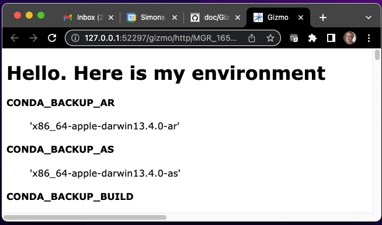
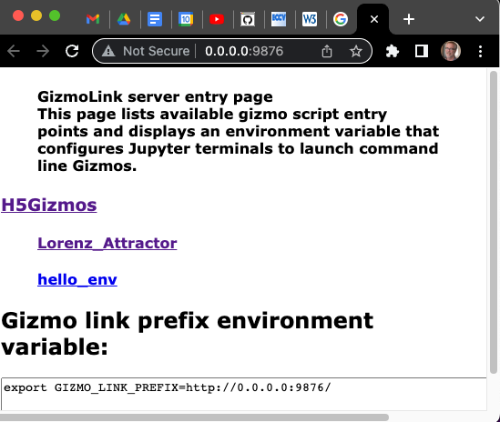

# Gizmo script entry points

A Python module may advertise H5Gizmo script entry points to publish user gizmo
based user interfaces.  
H5Gizmo script entry points advertise Gizmo scripts designed to be launched by the Gizmo Link proxy server in a subprocess.
These entry points may be discovered and launched from the command line
or using the GizmoLink proxy server interface.

## Trivial example entry point

An H5Gizmo script entry point should identify a Python function
that starts an H5Gizmo parent process which requires no standard input
or command line arguments

<a href="https://github.com/AaronWatters/H5Gizmos/blob/main/H5Gizmos/python/scripts/hello_env.py">
Content of hello_env.py</a>

```Python
from H5Gizmos import Html, serve
import os

def main():
    """
    A "hello world" Gizmo script which lists the environment variables for the parent process.
    """
    serve(task(), verbose=True)

async def task():
    paragraph = Html("<h1>Hello.  Here is my environment</h1>")
    await paragraph.show()
    for (name, value) in sorted(os.environ.items()):
        paragraph.add(Html("<h4>%s</h4>" % name))
        paragraph.add(Html("<blockquote>%s</blockquote>" % repr(value)))
    paragraph.add("Goodbye.")

if __name__ == "__main__":
    main()
```

## Registering the entry point in the module setup script

<a href="https://github.com/AaronWatters/H5Gizmos/blob/main/setup.py">H5Gizmos setup.py script, abbreviated</a>
```Python
from setuptools import setup
...

setup(
    name="H5Gizmos",
    ...
    entry_points={
        ...
        "H5Gizmos.scripts": [
            ...
            "hello_env = H5Gizmos.python.scripts.hello_env:main",
            ...
        ],
        ...
    },
    ...
)
```

## Optionally add a module top level documentation string

```Python
"Tools for building interactive graphical interfaces for applications using browser technology and HTML5"

from .python.gizmo_server import (
    serve,
    ...
)
...
```

## Discovering and launching the entry point from the command line

### Listing modules with entry points from the command line

```
$ gizmo_script 
The following modules advertise H5Gizmos.scripts entry points

gizmo_script H5Gizmos
```

### Listing entry points for a module from the command line

```
$ gizmo_script H5Gizmos
'H5Gizmos.scripts' entry points for 'H5Gizmos'

Module documentation string:
Tools for building interactive graphical interfaces for applications using browser technology and HTML5

2 entry points:

gizmo_script H5Gizmos/Lorenz_Attractor
    Interactive 3d view of a Lorenz attractor system with
    adjustable parameters.

gizmo_script H5Gizmos/hello_env 
    A "hello world" Gizmo script which lists the environment variables for the parent process.
```

### Launching an entry point from the command line using `gizmo_script`

```
$ gizmo_script H5Gizmos/hello_env
Created verbose GzServer
runner using port 52297
======== Running on http://0.0.0.0:52297 ========
(Press CTRL+C to quit)
```



## Listing modules with entry points from the proxy server

```
$ gizmo_link 9876 / GizmoLink
GizmoLink created.
GizmoLink app created.
======== Running on http://0.0.0.0:9876 ========
(Press CTRL+C to quit)
```




<a href="./README.md">
Return to Gizmo Scripts and the GizmoLink Proxy Server.
</a>