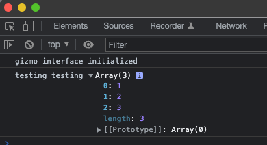
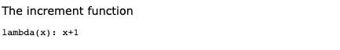
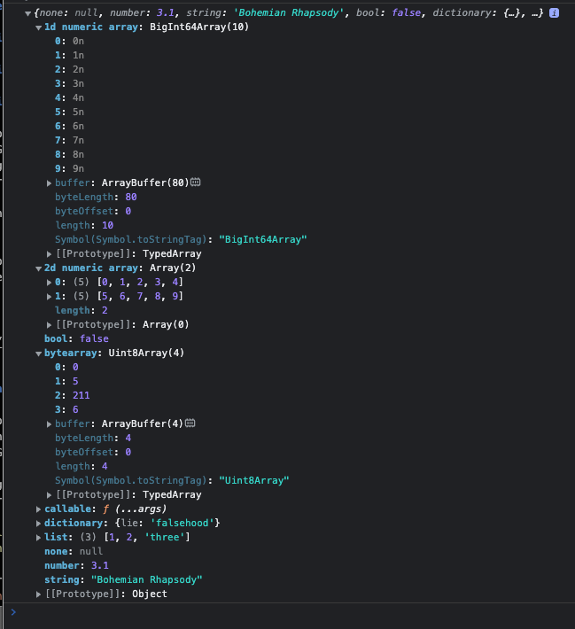
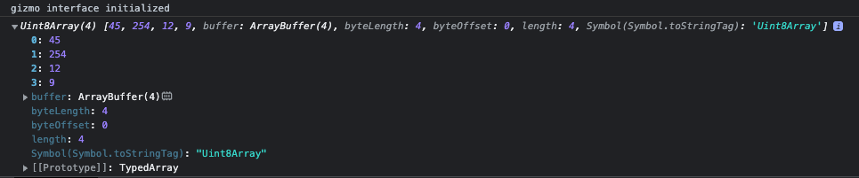
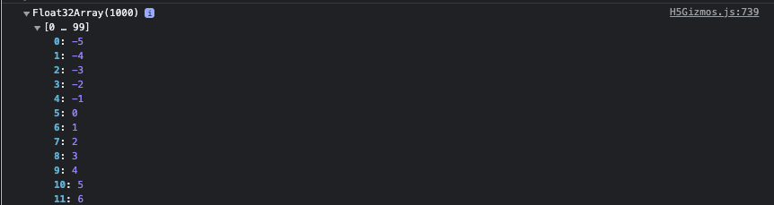

# Javascript Interface and Data Transfers

This document discusses communication between the Python parent process and the Javascript child
process and introduces some special methods for large data transfers.

# Sending commands from parent to child

In gizmo programs the parent process sends commands to the child process
by executing a Javascript expression and possibly storing or retrieving
the value of the expression.

Javascript expressions are represented in the parent process
by link objects.  For example the following script
retrieves the value for the link `greeting.window.innerHeight`
and executes the expression associated with the link
`greeting.element.text("Goodbye!")`.

```Python
from H5Gizmos import Html, serve, do, get

async def task():
    greeting = Html("<h1>Hello</h1>")
    await greeting.show()

    # Get some values:
    innerHeight = await get(greeting.window.innerHeight)
    print ("The inner height is", innerHeight)
    height = await get(greeting.element.height())
    print ("The element height is", height)

    # Do some actions
    do(greeting.window.console.log("testing testing", [1, 2, 3]))
    do(greeting.element.text("Goodbye!"))

serve(task())
```

The script prints the following to the command console:

```
(base) C02XD1KGJGH8:Javascript awatters$ python do_get_gizmo.py 
The inner height is 1480
The element height is 39
```

And opens the following interface in a browser tab:


Viewing the Javascript console for the browser tab reveals
the following console log output:



## Reference Objects

References to Javascript expressions in the parent process
are built from top level links by accessing attributes of
the top level link or by calling methods or function attached
to top level links.

### `component.element`

Every `component` is associated with an HTML object and the
attribute `component.element` is a top level link
to a jQuery container for the HTML object.

The following script creates a component `greeting` associated
with an HTML DIV object in the HTML page for the interface.

```Python
from H5Gizmos import Html, get, do
greeting = Html("<div><p>Paragraph 1</p> <p>Paragraph 2</p><div>")
await greeting.show()
```

The `greeting.element` link refers to a jQuery container
containing the DIV element.  The link itself is just an
object which knows how to access the jQuery container in the
child context.  References do not interact with the child
process directly -- for example the expression `greeting.element`
does not trigger any communication with the child process.
Instead it evaluates to the following printable representation. 

```
_CACHE_['jQueryComponent_1651080401924_9'][V(L('element'))]
```

and this representation is only useful for debugging.

The more complex expression link
`greeting.element.children().length`
prints as the following representation.

```
_CACHE_['jQueryComponent_1651080401924_9'][V(L('element'))][V(L('children'))]()[V(L('length'))]
```

Expression links are sent to the child process for evaluation using
the commands `get`, `do`, or `name`.  For example the following
evaluates `greeting.element.children().length` in the child process
and returns the length of the child list for the element

```Python
await get(greeting.element.children().length)
```

The result generated in this case is `3`.

Similarly the following expression gets the inner text
for the first child associated with the HTML DIV

```Python
await get(greeting.element.children()[0].innerText)
```

evaluating to

```
'Paragraph 1'
```

### `component.window`

Every `component` also holds a link to the global
`window` object in the Javascript child context.

For example for the `greeting` listed above the following
retrieves the vendor that provided the browser implementation.

```Python
await get(greeting.window.clientInformation.vendor)
```

For the Chrome browser the result returned is

```
'Google Inc.'
```

### `component.document`

For convenience each `component` also stores a link
to the global `component.document` object for the HTML frame.
For example, for the `greeting` above the following
evaluates to the host name associated with the document:

```Python
await get(greeting.document.location.hostname)
```

which in may case evaluates to

```
'192.168.1.173'
```

### `component.jQuery`

Each `component` also stores a link to the
global `component.jQuery` object.  For the `greeting`
above the following lists the `jQuery` version.

```Python
await get(greeting.jQuery().jquery)
```
which evaluates to 
```
'3.1.1'
```

The following script uses the `div.jQuery` link
to append a preformatted text.

```Python
from H5Gizmos import Html, do

div = Html("<div>The increment function</div>")
await div.show()
do(div.jQuery("<pre>lambda(x): x+1</pre>").appendTo(div.element))
```

The resulting interface looks like this:



### Reference commands

Reference commands transfer representations for Javascript expressions to the 
child context where the child context attempts to execute the expression.

## `H5Gizmos.do`

The `do` command executes a Javascript expression and discards the result of the
expression.  

In the example shown above the command
```Python
do(greeting.window.console.log("testing testing", [1, 2, 3]))
```
executes a Javascript expression which generates a log message in
the Javascript console window.

The `do` command accepts an optional `to_depth` argument (see discussion below) which specifies
a cut off level for arguments sent to any call back functions contained in
the `link` expression:

In the code below any arguments passed to the `callback` will be
translated at most 3 levels deep in the child context before it is transfered
to the parent.

```Python
def callback(*args):
    ...

do(greeting.element.window.onUnload(callback), to_depth=3)
```

Any exception detected during the `do` evaluation is reported to the
parent process asynchronously.

## `H5Gizmos.get`

The `get` command coroutine executes a Javascript expression in the child context
and sends the (translated) result back to the parent.

In the example above the command
```
innerHeight = await get(greeting.window.innerHeight)
```
returns the value for the Javascript expression
`window.innerHeight`.

The `get` command also supports the `to_depth` parameter
which controls the cut off level for translating the return
result, and also for arguments sent to any callbacks
contained in the link expression (see discussion below).

Exceptions generated during the evaluation are propagated
as exceptions for the `get` coroutine.
For example the line
```Python
test = await get(greeting.element.no_such_function(3))
```
generates the traceback
```python-traceback
JavascriptEvalException                   Traceback (most recent call last)
<ipython-input-41-d9a9e28a03b6> in async-def-wrapper()

~/repos/H5Gizmos/H5Gizmos/python/H5Gizmos.py in get(link_action, to_depth, timeout)
     37     "Run the link in javascript and return the result."
     38     # command style convenience convenience accessor
---> 39     return await link_action._get(to_depth=to_depth, timeout=timeout)
     40 
     41 def name(id, link_action, to_depth=None):

~/repos/H5Gizmos/H5Gizmos/python/H5Gizmos.py in _get(self, to_depth, timeout, oid, future, test_result)
    661         if test_result is not None:
    662             return test_result  # only for code coverage...
--> 663         await future
    664         self._get_oid = None
    665         self._get_future = None

JavascriptEvalException: js error: 'Error: get no_such_function from [object Object] not truthy: undefined'
```

## `H5Gizmos.name`

The `name` command is similar to the `do` command
except that value generated by evaluating the expression
is stored in an object cache shared by all components.
The result of the name command on the parent side is
a reference to the cache location on the child side.

In the following example the document location object
is cached in the child context using the name `location`.

```Python
from H5Gizmos import Html, name, get
greeting = Html("<h4>Hello</h4>")
await greeting.show()

location = name("location", greeting.document.location)
```

The parent process can use the returned `location` cache
link to access methods of the document location object
for example as follows:

```Python
await get(location.toString())
```

which evaluated to

```
'http://192.168.1.173:8675/gizmo/http/MGR_1651093175260_20/index.html'
```

## Parent argument conversion

The parent and child contexts do not share memory space,
so arguments passed between the two contexts must be encoded
and transferred.

Arguments sent from the parent context to the child context
are encoded using  
<a href="https://www.json.org/json-en.html">
a JSON-like convention 
</a>
with extensions.

For example the following code transfers a dictionary
object containing other example objects from the parent
to the child:

```Python
import numpy as np
from H5Gizmos import Html

greeting = Html("<h3>Hello</h3>")
await greeting.show()

def callable_example(*arguments):
    print("callback called with arguments: ", arguments)

structure = {
    "none": None,
    "number": 3.1,
    "string": "Bohemian Rhapsody",
    "bool": False,
    "dictionary": {"lie": "falsehood"},
    "list": [1,2,"three"],
    "bytearray": bytearray([0,5,211,6]),
    "callable": callable_example,
    "1d numeric array": np.arange(10),
    "2d numeric array": np.arange(10).reshape(2,5),
}
do(greeting.window.console.log(structure))
```

The Javascript console reveals the objects reconstructed
using JSON conventions, except for the arrays and the callable function:



The `callable_example` is converted to a callback function
in the child context.  Calling the callback will send a message
to the parent context to execute the `callable_example` function.

The byte array is converted to a `UInt8Array`.

The 2d numeric array is converted to a list of lists.  Any
numeric array of more than 1 dimension will convert to a list of lists.

The 1d numeric array is converted to a Javascript array buffer object
of an appropriate type according to the following mapping:

```Python
from H5Gizmos.python.gz_components import JS_COLLECTION_NAME_MAP
```

with value

```Python
{numpy.int8: 'Int8Array',
 numpy.uint8: 'Uint8Array',
 numpy.int16: 'Uint16Array',
 numpy.int32: 'Int32Array',
 numpy.uint32: 'Uint32Array',
 numpy.float32: 'Float32Array',
 numpy.float64: 'Float64Array',
 numpy.int64: 'BigInt64Array',
 numpy.uint64: 'BigUint64Array',
 dtype('int8'): 'Int8Array',
 dtype('uint8'): 'Uint8Array',
 dtype('int16'): 'Uint16Array',
 dtype('int32'): 'Int32Array',
 dtype('uint32'): 'Uint32Array',
 dtype('float32'): 'Float32Array',
 dtype('float64'): 'Float64Array',
 dtype('int64'): 'BigInt64Array',
 dtype('uint64'): 'BigUint64Array'}
 ```

Values which cannot be converted will generate an exception
in the parent process.  For example there is no conversion for
a numeric complex python value defined:

```Python
import numpy as np
C = np.zeros((3,), dtype=np.complex)
do(greeting.window.console.log(C))
```

```python-traceback
---------------------------------------------------------------------------
CantConvertValue                          Traceback (most recent call last)
<ipython-input-43-d1a119046167> in <module>
      1 import numpy as np
      2 C = np.zeros((3,), dtype=np.complex)
----> 3 do(greeting.window.console.log(C))

~/repos/H5Gizmos/H5Gizmos/python/H5Gizmos.py in __call__(self, *args)
    692     def __call__(self, *args):
    693         gz = self._owner_gizmo
--> 694         arg_commands = [ValueConverter(x, gz) for x in args]
    695         #pr(self, "making gizmocall", arg_commands)
    696         return GizmoCall(self, arg_commands, gz)

~/repos/H5Gizmos/H5Gizmos/python/H5Gizmos.py in <listcomp>(.0)
    692     def __call__(self, *args):
    693         gz = self._owner_gizmo
--> 694         arg_commands = [ValueConverter(x, gz) for x in args]
    695         #pr(self, "making gizmocall", arg_commands)
    696         return GizmoCall(self, arg_commands, gz)

~/repos/H5Gizmos/H5Gizmos/python/H5Gizmos.py in __init__(self, value, owner)
    939             conversions = []
    940             for x in translation:
--> 941                 c = ValueConverter(x,owner)
    942                 if not c.is_literal:
    943                     self.is_literal = False

~/repos/H5Gizmos/H5Gizmos/python/H5Gizmos.py in __init__(self, value, owner)
    976             self.command = GizmoCallback(translation, owner)
    977         else:
--> 978             raise CantConvertValue("No conversion for: " + repr(ty))
    979 
    980     def _command(self, to_depth):

CantConvertValue: No conversion for: <class 'complex'>
```


## Calling back to the parant

Callable objects from the parent process context (such as functions
and methods) are converted in the child process to call back objects.
These callback objects are useful for triggering a response in the
parent to some sort of event in the child context.  The return value
for the callback is discarded and any exception from the callback
is reported in the parent process, but not transferred to the child context.

Please see the 
<a href="../Tutorials/hello2.md">Hello 2</a>
Tutorial for a simple example of a callback function.

## Child result value conversion

Results from the `get` command coroutine and arguments
to callbacks from the child to the parent are converted
using a JSON-like convention and transmitted to the parent.

For example the following code attaches a `send_value`
function to the `greeting.element` which generates a
mapping containing a collection of example values:

```Python
from H5Gizmos import Html, name, get
greeting = Html("<h4>Hello</h4>")
await greeting.show()

greeting.js_init("""

    element.send_value = function() {
        return {
            "null": null,
            "number": 3.1,
            "string": "Bohemian Rhapsody",
            "bool": false,
            "dictionary": {"lie": "falsehood"},
            "list": [1,2,"three"],
            "Uint8Array": new Uint8Array([0, 5, 211, 6]),
            "callable": element.send_value,
        }
    };
""")
```

Evaluating the `send_value` function using a `get` command
converts the return value mapping to corresponding data types
in the parent process:

```Python
js_value = await get(greeting.element.send_value())
js_value
```

generating the value:

```Python
{'null': None,
 'number': 3.1,
 'string': 'Bohemian Rhapsody',
 'bool': False,
 'dictionary': {'lie': 'falsehood'},
 'list': [1, 2, 'three'],
 'Uint8Array': '0005d306',
 'callable': {}}
```

The conversion follows JSON conventions except that
the value is truncated at a recursive depth (see `to_depth` below)
and the `Uint8Array` is converted to a hexidecimal encoded string.

The following decodes the hex string into a Python byte array:

```Python
from H5Gizmos import hex_to_bytearray
B = hex_to_bytearray(js_value["Uint8Array"])
B
```

`bytearray(b'\x00\x05\xd3\x06')`

```Python
[int(x) for x in B]
```

```Python
[0, 5, 211, 6]
```

See the section on binary data transfers below for alternative
methods of transfering numeric data between the parent and child contexts.

## `to_depth`

```Python
greeting.js_init("""
    var loop = {};
    loop.name = "loop";
    loop.reference = loop;
    element.loop = loop;
""")
```

```Python
await get(greeting.element.loop, to_depth=2)
```

```Python
{'name': 'loop', 'reference': {'name': 'loop', 'reference': None}}
```

```Python
await get(greeting.element.loop, to_depth=4)
```

```Python
{'name': 'loop',
 'reference': {'name': 'loop',
  'reference': {'name': 'loop',
   'reference': {'name': 'loop', 'reference': None}}}}
```

## `timeout`

```Python
from H5Gizmos import Html, name, get
greeting = Html("<h4>Hello</h4>")
await greeting.show()

greeting.js_init("""

    element.resolves_in_10_seconds = function() {
        var result = new H5Gizmos.DeferredValue();
        // Resolve the value to 42 after waiting 10 seconds.
        setTimeout( (function() { result.resolve(42);}), 10 * 1000 );
        return result;
    };

""")
```

The following invocation produces the value `42` after a 10 second delay.
```Python
await get(greeting.element.element.resolves_in_10_seconds(), timeout=13)
```

But the following invocation
```
await get(greeting.element.resolves_in_10_seconds(), timeout=5)
```

generates the following exception traceback after waiting for 5 seconds:

```python-traceback
---------------------------------------------------------------------------
FutureTimeout                             Traceback (most recent call last)
<ipython-input-3-6086988edda4> in async-def-wrapper()

~/repos/H5Gizmos/H5Gizmos/python/H5Gizmos.py in get(link_action, to_depth, timeout)
     37     "Run the link in javascript and return the result."
     38     # command style convenience convenience accessor
---> 39     return await link_action._get(to_depth=to_depth, timeout=timeout)
     40 
     41 def name(id, link_action, to_depth=None):

~/repos/H5Gizmos/H5Gizmos/python/H5Gizmos.py in _get(self, to_depth, timeout, oid, future, test_result)
    661         if test_result is not None:
    662             return test_result  # only for code coverage...
--> 663         await future
    664         self._get_oid = None
    665         self._get_future = None

FutureTimeout: Timeout expired: 5
```

The timeout argument for `do`, `name`, and `component.js_init` specify time out values
for any callback functions created during the execution of the action.

# Declaring Dynamic Javascript

## `component.js_init`

```Python
from H5Gizmos import Html, get
greeting = Html("<h1>Hello</h1>")
await greeting.show()
txt = greeting.add("Welcome!")

properties = "font-style font-weight font-family font-size".split()

greeting.js_init(
    """
        element.get_font_properties = function(jquery_target) {
        debugger;
            jquery_target = jquery_target || element;
            var style = window.getComputedStyle(jquery_target[0]);
            result = {};
            for (var i=0; i<properties.length; i++) {
                var prop = properties[i];
                result[prop] = style[prop];
            }
            return result
        }
    """, 
    properties=properties)
```

```Python
await get(greeting.element.get_font_properties())
```

```Python
{'font-style': 'normal',
 'font-weight': '700',
 'font-family': 'Verdana, Arial, Helvetica, sans-serif',
 'font-size': '32px'}
```

```Python
await get(greeting.element.get_font_properties(txt.element))
```

```Python
{'font-style': 'normal',
 'font-weight': '400',
 'font-family': 'Verdana, Arial, Helvetica, sans-serif',
 'font-size': '16px'}
```

## `component.new`

```Python
from H5Gizmos import Html, do
greeting = Html("<h1>Hello</h1>")
await greeting.show()

window = greeting.window
new_uint = greeting.new(window.Uint8Array, [45, 254, 12, 9])
do(window.console.log(new_uint))
```

equivalent of

```javascript
console.log( new Uint8Array([45, 254, 12, 9]))
```



## `component.js_debug`

```Python
from H5Gizmos import Html, do
greeting = Html("<h1>Hello</h1>")
await greeting.show()
```

```Python
greeting.js_debug()
```


# Caching Javascript Values

## `component.cache`

```Python
from H5Gizmos import Html, get
greeting = Html("<h1>Hello</h1>")
await greeting.show()

import numpy as np
A = np.sin(0.01 * np.arange(1000))
reference = greeting.cache("Sines", A)
do(greeting.window.console.log(reference))
```


## `component.my`

```Python
reference = greeting.my("Sines")
do(greeting.window.console.log(reference))
```

## `component.uncache`

```Python
greeting.uncache("Sines")
print(await get(greeting.my("Sines")))
```

prints `None`.

# Transferring binary data and large data

## `component.store_json`

```Python
json_structure = {
    "none": None,
    "number": 3.1,
    "string": "Bohemian Rhapsody",
    "bool": False,
    "dictionary": {"lie": "falsehood"},
    "list": [1,2,"three"],
}

from H5Gizmos import Html, do, get
greeting = Html("<h1>Hello</h1>")
await greeting.show()

reference = await greeting.store_json(json_structure, "my_data")

print("string value", await get(reference["string"]))
```

```
string value Bohemian Rhapsody
```

## `component.store_array`

```Python
import numpy as np

A = (np.arange(1000) % 13 - 5).astype(np.float32)

from H5Gizmos import Html, do, get
greeting = Html("<h1>Hello</h1>")
await greeting.show()

reference = await greeting.store_array(A, "my_array")
do(greeting.window.console.log(reference))
```



## `component.get_array_from_buffer`

```Python
B = await greeting.get_array_from_buffer(reference, dtype=np.float32)
np.abs(A - B).max()
```

evaluates to `0.0`

<a href="../README.md">
Return to H5Gizmos documentation root.
</a>
