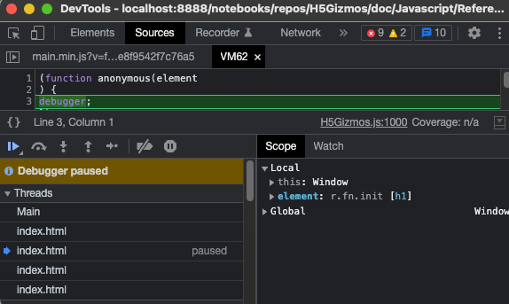
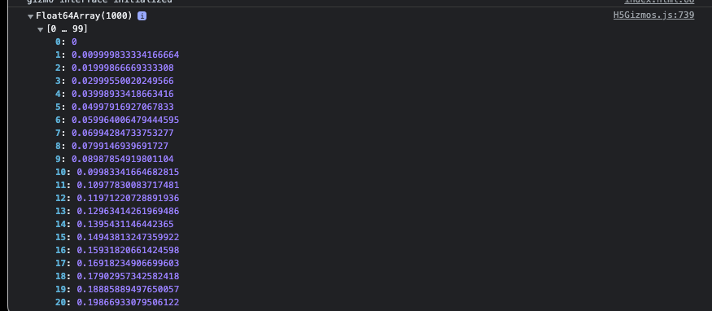

# Javascript Interface and Data Transfers

This document discusses communication between the Python parent process and the Javascript child
process and introduces some special methods for large data transfers.

# Sending commands from parent to child

In gizmo programs the parent process sends commands to the child process
by executing a Javascript expression and possibly storing or retrieving
the value of the expression.

Javascript expressions are represented in the parent process
by reference objects.  For example the following script
retrieves the value for the reference `greeting.window.innerHeight`
and executes the expression associated with the reference
`greeting.element.text("Goodbye!")`.

```Python
from H5Gizmos import Html, serve, do, get

async def task():
    greeting = Html("<h1>Hello</h1>")
    await greeting.show()

    # Get some values:
    innerHeight = await get(greeting.window.innerHeight)
    print ("The inner height is", innerHeight)
    height = await get(greeting.element.height())
    print ("The element height is", height)

    # Do some actions
    do(greeting.window.console.log("testing testing", [1, 2, 3]))
    do(greeting.element.text("Goodbye!"))

serve(task())
```

The script prints the following to the command console:

```
(base) C02XD1KGJGH8:Javascript awatters$ python do_get_gizmo.py 
The inner height is 1480
The element height is 39
```

And opens the following interface in a browser tab:


Viewing the Javascript console for the browser tab reveals
the following console log output:


## Reference Objects

References to Javascript expressions in the parent process
are built from top level references by accessing attributes of
the top level reference or by calling methods or function attached
to top level references.

### `component.element`

Every `component` is associated with an HTML object and the
attribute `component.element` is a top level reference
to a jQuery container for the HTML object.

The following script creates a component `greeting` associated
with an HTML DIV object in the HTML page for the interface.

```Python
from H5Gizmos import Html, get, do
greeting = Html("<div><p>Paragraph 1</p> <p>Paragraph 2</p><div>")
await greeting.show()
```

The `greeting.element` reference refers to a jQuery container
containing the DIV element.  The reference itself is just an
object which knows how to access the jQuery container in the
child context.  References do not interact with the child
process directly -- for example the expression `greeting.element`
does not trigger any communication with the child process.
Instead it evaluates to the following printable representation. 

```
_CACHE_['jQueryComponent_1651080401924_9'][V(L('element'))]
```

and this representation is only useful for debugging.

The more complex expression reference
`greeting.element.children().length`
prints as the following representation.

```
_CACHE_['jQueryComponent_1651080401924_9'][V(L('element'))][V(L('children'))]()[V(L('length'))]
```

Expression references are sent to the child process for evaluation using
the commands `get`, `do`, or `name`.  For example the following
evaluates `greeting.element.children().length` in the child process
and returns the length of the child list for the element

```Python
await get(greeting.element.children().length)
```

The result generated in this case is `3`.

Similarly the following expression gets the inner text
for the first child associated with the HTML DIV

```Python
await get(greeting.element.children()[0].innerText)
```

evaluating to

```
'Paragraph 1'
```

### `component.window`

Every `component` also holds a reference to the global
`window` object in the Javascript child context.

For example for the `greeting` listed above the following
retrieves the vendor that provided the browser implementation.

```Python
await get(greeting.window.clientInformation.vendor)
```

For the Chrome browser the result returned is

```
'Google Inc.'
```

### `component.document`

For convenience each `component` also stores a reference
to the global `component.document` object for the HTML frame.
For example, for the `greeting` above the following
evaluates to the host name associated with the document:

```Python
await get(greeting.document.location.hostname)
```

which in may case evaluates to

```
'192.168.1.173'
```

### `component.jQuery`

Each `component` also stores a reference to the
global `component.jQuery` object.  For the `greeting`
above the following lists the `jQuery` version.

```Python
await get(greeting.jQuery().jquery)
```
which evaluates to 
```
'3.1.1'
```

The following script uses the `div.jQuery` reference
to append a preformatted text.

```Python
from H5Gizmos import Html, do

div = Html("<div>The increment function</div>")
await div.show()
do(div.jQuery("<pre>lambda(x): x+1</pre>").appendTo(div.element))
```

The resulting interface looks like this:


### Reference commands

## `H5Gizmos.do`

## `H5Gizmos.get`

## `H5Gizmos.name`

```Python
from H5Gizmos import Html, name, get
greeting = Html("<h4>Hello</h4>")
await greeting.show()

location = name("location", greeting.document.location)
```

```Python
await get(location.toString())
```

```
'http://192.168.1.173:8675/gizmo/http/MGR_1651093175260_20/index.html'
```

## Parent argument conversion

```Python
import numpy as np
from H5Gizmos import Html

greeting = Html("<h3>Hello</h3>")
await greeting.show()

def callable_example(*arguments):
    print("callback called with arguments: ", arguments)

structure = {
    "none": None,
    "number": 3.1,
    "string": "Bohemian Rhapsody",
    "bool": False,
    "dictionary": {"lie": "falsehood"},
    "list": [1,2,"three"],
    "bytearray": bytearray([0,5,211,6]),
    "callable": callable_example,
    "1d numeric array": np.arange(10),
    "2d numeric array": np.arange(10).reshape(2,5),
}
do(greeting.window.console.log(structure))
```


```Python
from H5Gizmos.python.gz_components import JS_COLLECTION_NAME_MAP
```

```Python
{numpy.int8: 'Int8Array',
 numpy.uint8: 'Uint8Array',
 numpy.int16: 'Uint16Array',
 numpy.int32: 'Int32Array',
 numpy.uint32: 'Uint32Array',
 numpy.float32: 'Float32Array',
 numpy.float64: 'Float64Array',
 numpy.int64: 'BigInt64Array',
 numpy.uint64: 'BigUint64Array',
 dtype('int8'): 'Int8Array',
 dtype('uint8'): 'Uint8Array',
 dtype('int16'): 'Uint16Array',
 dtype('int32'): 'Int32Array',
 dtype('uint32'): 'Uint32Array',
 dtype('float32'): 'Float32Array',
 dtype('float64'): 'Float64Array',
 dtype('int64'): 'BigInt64Array',
 dtype('uint64'): 'BigUint64Array'}
 ```


## Calling back to the parant

## Call back child result value conversion

```Python
from H5Gizmos import Html, name, get
greeting = Html("<h4>Hello</h4>")
await greeting.show()

greeting.js_init("""

    element.send_value = function() {
        return {
            "null": null,
            "number": 3.1,
            "string": "Bohemian Rhapsody",
            "bool": false,
            "dictionary": {"lie": "falsehood"},
            "list": [1,2,"three"],
            "Uint8Array": new Uint8Array([0, 5, 211, 6]),
            "callable": element.send_value,
        }
    };
""")
```

```Python
js_value = await get(greeting.element.send_value())
js_value
```

```Python
{'null': None,
 'number': 3.1,
 'string': 'Bohemian Rhapsody',
 'bool': False,
 'dictionary': {'lie': 'falsehood'},
 'list': [1, 2, 'three'],
 'Uint8Array': '0005d306',
 'callable': {}}
```

```Python
from H5Gizmos import hex_to_bytearray
B = hex_to_bytearray(js_value["Uint8Array"])
B
```

`bytearray(b'\x00\x05\xd3\x06')`

```Python
[int(x) for x in B]
```

```Python
[0, 5, 211, 6]
```

## `to_depth`

```Python
greeting.js_init("""
    var loop = {};
    loop.name = "loop";
    loop.reference = loop;
    element.loop = loop;
""")
```

```Python
await get(greeting.element.loop, to_depth=2)
```

```Python
{'name': 'loop', 'reference': {'name': 'loop', 'reference': None}}
```

```Python
await get(greeting.element.loop, to_depth=4)
```

```Python
{'name': 'loop',
 'reference': {'name': 'loop',
  'reference': {'name': 'loop',
   'reference': {'name': 'loop', 'reference': None}}}}
```

## `timeout`

```Python
from H5Gizmos import Html, name, get
greeting = Html("<h4>Hello</h4>")
await greeting.show()

greeting.js_init("""

    element.resolves_in_10_seconds = function() {
        var result = new H5Gizmos.DeferredValue();
        // Resolve the value to 42 after waiting 10 seconds.
        setTimeout( (function() { result.resolve(42);}), 10 * 1000 );
        return result;
    };

""")
```

The following invocation produces the value `42` after a 10 second delay.
```Python
await get(greeting.element.element.resolves_in_10_seconds(), timeout=13)
```

But the following invocation
```
await get(greeting.element.resolves_in_10_seconds(), timeout=5)
```

generates the following exception traceback after waiting for 5 seconds:

```python-traceback
---------------------------------------------------------------------------
FutureTimeout                             Traceback (most recent call last)
<ipython-input-3-6086988edda4> in async-def-wrapper()

~/repos/H5Gizmos/H5Gizmos/python/H5Gizmos.py in get(link_action, to_depth, timeout)
     37     "Run the link in javascript and return the result."
     38     # command style convenience convenience accessor
---> 39     return await link_action._get(to_depth=to_depth, timeout=timeout)
     40 
     41 def name(id, link_action, to_depth=None):

~/repos/H5Gizmos/H5Gizmos/python/H5Gizmos.py in _get(self, to_depth, timeout, oid, future, test_result)
    661         if test_result is not None:
    662             return test_result  # only for code coverage...
--> 663         await future
    664         self._get_oid = None
    665         self._get_future = None

FutureTimeout: Timeout expired: 5
```

The timeout argument for `do`, `name`, and `component.js_init` specify time out values
for any callback functions created during the execution of the action.

# Declaring Dynamic Javascript

## `component.js_init`

```Python
from H5Gizmos import Html, get
greeting = Html("<h1>Hello</h1>")
await greeting.show()
txt = greeting.add("Welcome!")

properties = "font-style font-weight font-family font-size".split()

greeting.js_init(
    """
        element.get_font_properties = function(jquery_target) {
        debugger;
            jquery_target = jquery_target || element;
            var style = window.getComputedStyle(jquery_target[0]);
            result = {};
            for (var i=0; i<properties.length; i++) {
                var prop = properties[i];
                result[prop] = style[prop];
            }
            return result
        }
    """, 
    properties=properties)
```

```Python
await get(greeting.element.get_font_properties())
```

```Python
{'font-style': 'normal',
 'font-weight': '700',
 'font-family': 'Verdana, Arial, Helvetica, sans-serif',
 'font-size': '32px'}
```

```Python
await get(greeting.element.get_font_properties(txt.element))
```

```Python
{'font-style': 'normal',
 'font-weight': '400',
 'font-family': 'Verdana, Arial, Helvetica, sans-serif',
 'font-size': '16px'}
```

## `component.new`

```Python
from H5Gizmos import Html, do
greeting = Html("<h1>Hello</h1>")
await greeting.show()

window = greeting.window
new_uint = greeting.new(window.Uint8Array, [45, 254, 12, 9])
do(window.console.log(new_uint))
```

equivalent of

```javascript
console.log( new Uint8Array([45, 254, 12, 9]))
```


## `component.js_debug`

```Python
from H5Gizmos import Html, do
greeting = Html("<h1>Hello</h1>")
await greeting.show()
```

```Python
greeting.js_debug()
```



# Caching Javascript Values

## `component.cache`

```Python
from H5Gizmos import Html, get
greeting = Html("<h1>Hello</h1>")
await greeting.show()

import numpy as np
A = np.sin(0.01 * np.arange(1000))
reference = greeting.cache("Sines", A)
do(greeting.window.console.log(reference))
```



## `component.my`

```Python
reference = greeting.my("Sines")
do(greeting.window.console.log(reference))
```

## `component.uncache`

```Python
greeting.uncache("Sines")
print(await get(greeting.my("Sines")))
```

prints `None`.

# Transferring binary data and large data

## `component.store_json`

```Python
json_structure = {
    "none": None,
    "number": 3.1,
    "string": "Bohemian Rhapsody",
    "bool": False,
    "dictionary": {"lie": "falsehood"},
    "list": [1,2,"three"],
}

from H5Gizmos import Html, do, get
greeting = Html("<h1>Hello</h1>")
await greeting.show()

reference = await greeting.store_json(json_structure, "my_data")

print("string value", await get(reference["string"]))
```

```
string value Bohemian Rhapsody
```

## `component.store_array`

```Python
import numpy as np

A = (np.arange(1000) % 13 - 5).astype(np.float32)

from H5Gizmos import Html, do, get
greeting = Html("<h1>Hello</h1>")
await greeting.show()

reference = await greeting.store_array(A, "my_array")
do(greeting.window.console.log(reference))
```


## `component.get_array_from_buffer`

```Python
B = await greeting.get_array_from_buffer(reference, dtype=np.float32)
np.abs(A - B).max()
```

evaluates to `0.0`

<a href="../README.md">
Return to H5Gizmos documentation root.
</a>
