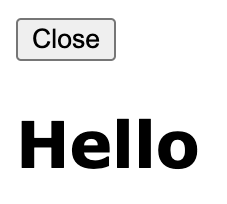
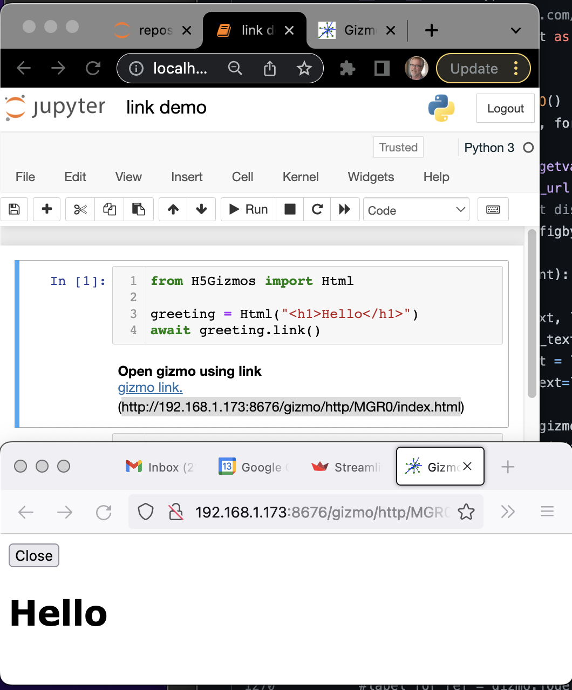
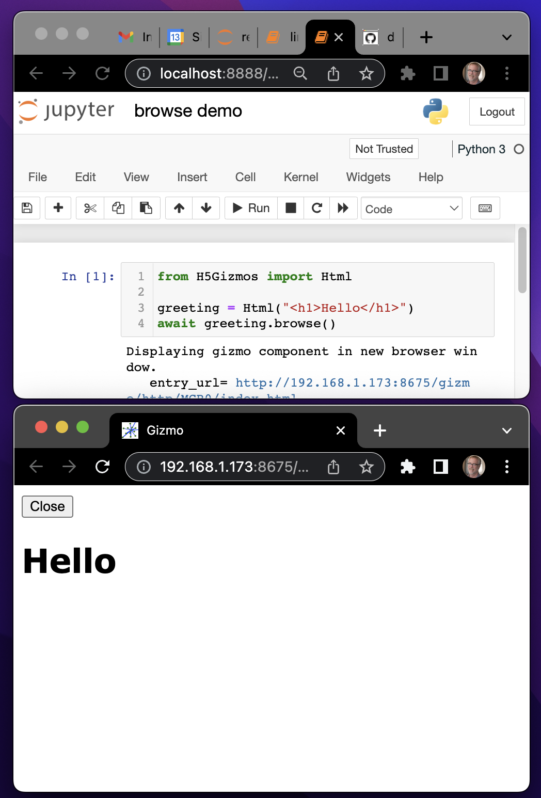
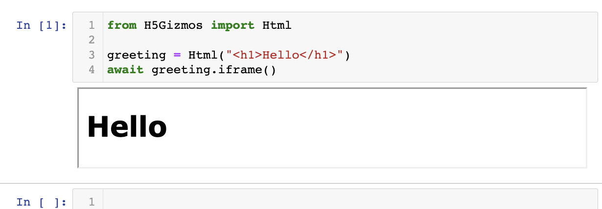
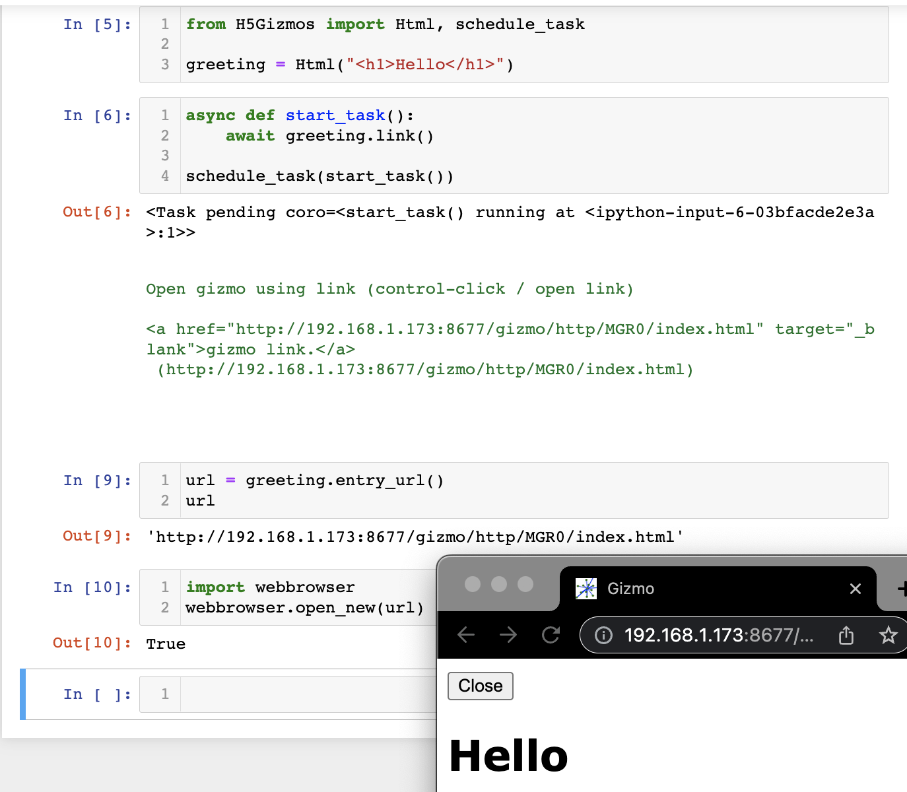
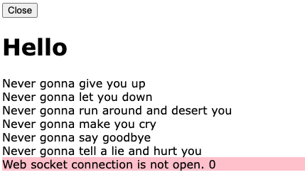

# Process Management

This document provides information relating to tasks associated with Gizmos and how to manage those tasks.

A running gizmo interface interacts with at least three flows of control:

- A special purpose HTTP server that end users normally don't interact with directly shared by
all gizmo interfaces from the same parent process.

- A parent task that "starts" the gizmo graphical interface.

- A child context running in a browser frame that connects to the parent and presents the graphical interface.

When running in a Jupyter notebook the shared HTTP server is created as soon as it is
needed by the first gizmo and it normally continues to "run/wait" in the background
until the Jupyter kernel task terminates.  In this case there is usually no need to explicitly
terminate the server.

## `H5Gizmos.serve`

The `serve` function sets up the HTTP server and starts
a gizmo task for a gizmo running as a stand-alone command line script.

The following minimal example usage displays a header text using a stand alone command line script.

```Python
# contents of ./hello0.py
from H5Gizmos import Html, serve

async def task():
    greeting = Html("<h1>Hello</h1>")
    await greeting.show()

serve(task())
```
When run from the command line like so:
```bash
% python hello0.py
```
The script displays a new browser tab that looks like this:



Normally the HTTP server and the parent process for a stand alone task will terminate
when the user closes the gizmo interface browser tab.  In the event the parent task
does not receive the "close" notification the process can be terminated from the command
line using `Control-C`.

# Gizmo start modes

A gizmo interface may start automatically in a new browser frame,
or it may start automatically in an embedded frame in a Jupyter notebook,
or it can also not start automatically, but wait for a client to connect
to the 'entry url' by some other means.

## `component.link`

The `link` coroutine prepares the parent process to present
a gizmo interface but does not automatically connect a child context
to the interface -- the coroutine prints connection information and
waits passively for a client to connect.

In the following screen shot a Jupyter notebook running in the Chrome browser executes
```Python
from H5Gizmos import Html

greeting = Html("<h1>Hello</h1>")
await greeting.link()
```
And the user used the displayed URL to present the gizmo interface using the Firefox browser (below the notebook)
instead of the default Chrome browser.



The `link` mode can be useful to give
the user control of how to start the child context.

## `component.browse`

The `browse` coroutine automatically opens a gizmo user interface using a new browser
tab even if the gizmo is started within a Jupyter notebook.

In the screenshot below a Jupyter notebook executes

```Python
from H5Gizmos import Html

greeting = Html("<h1>Hello</h1>")
await greeting.browse()
```

and the resulting gizmo interface displays in a new browser tab (outside of the notebook document).
In the screenshot the tab has been positioned below the notebook.



It can be useful to display a gizmo in a separate window from a Jupyter notebook,
particularly if the interface is large and complex.

## `component.iframe`

The `iframe` coroutine automatically opens a gizmo user interface in a Jupyter
notebook using an embedded `iframe`.  This method will not work unless it is used
in a Jupyter notebook.

In the screenshot below a Jupyter notebook executes

```Python
from H5Gizmos import Html

greeting = Html("<h1>Hello</h1>")
await greeting.iframe()
```

and the gizmo user interface appears in the notebook in an embedded frame.



## `component.show`

The `show` method automatically opens a gizmo interface in an embedded `iframe` if the gizmo
is starting in a Jupyter notebook (like `iframe`), 
otherwise it will open the interface in a new browser window (like `browse`).
Please see the discussion of `hello0.py` above for an example usage.

# Other task related features

## `component.entry_url`

Once a gizmo primary component has been configured in the parent in any of the above modes
it has an `entry_url()`.  The first connection to the `entry_url()` from a browser will establish
a child context.  Only one connection is permitted -- any additional connection attempts will
be rejected by the HTTP server end point handler.

The screenshot below shows a contrived example of using `entry_url` which
duplicates some logic from the implementation of the `browse` coroutine.



Here the following code sets up a gizmo in the parent without connecting
a child context using a subtask:

```Python
from H5Gizmos import Html, schedule_task

greeting = Html("<h1>Hello</h1>")

async def start_task():
    await greeting.link()
    
schedule_task(start_task())
```

When the subtask waits for the child connection the `greeting` component
has an assigned `url = greeting.entry_url()`:
```
'http://192.168.1.173:8677/gizmo/http/MGR0/index.html'
```
The notebook connects to the URL in a new browser tab using the `webbrowser` module.
The new tab is positioned above the lower right of the notebook.

## `component.shutdown`

The `shutdown` method shuts down the parent process.  Due to browser
security restrictions the method does not automatically shut down the
child context if the child context is still active.

The 
<a href="./promise.py">promise.py</a>
script shown below displays some information in a new browser tab
and then terminates via `greeting.shutdown()`.
It uses `asyncio.sleep` to wait for a short
while before the termination to allow all messages to transmit
between the parent and child before the parent goes away.

```Python
# contents of promise.py
from H5Gizmos import Html, serve
import asyncio

lyrics = """
Never gonna give you up
Never gonna let you down
Never gonna run around and desert you
Never gonna make you cry
Never gonna say goodbye
Never gonna tell a lie and hurt you
""".strip().split("\n")

async def task():
    greeting = Html("<h1>Hello</h1>")
    await greeting.show()
    for txt in lyrics:
        greeting.add(txt)
    await asyncio.sleep(0.2)
    greeting.shutdown()

serve(task())
```
Run from a command line like this
```bash
% python promise.py
```
the script opens a new browser tab that looks like this:



## `H5Gizmos.schedule_task`

The `schedule_task` function is the official interface
for scheduling a sub-task for a gizmo interface.
Please see the `entry_url` discussion for an example usage.

<a href="../README.md">
Return to H5Gizmos documentation root.
</a>
