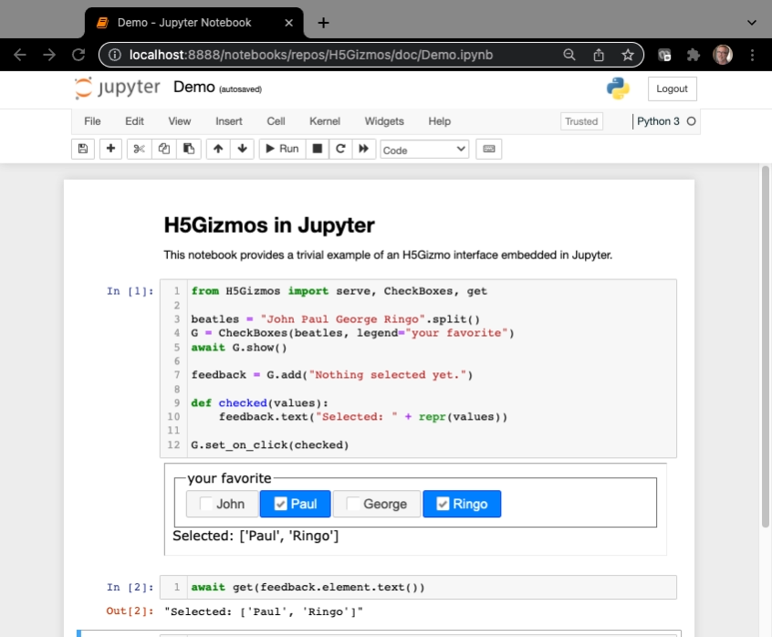

# H5Gizmos documentation

This is the start page for H5Gizmo documentation.
The H5Gizmos documentation is provided using Github markdown for simplicity.
If you wish to view the documentation locally from a clone of the repository,
please use
<a href="https://github.com/joeyespo/grip">https://github.com/joeyespo/grip</a>
or a similar github emulator.  I start it like this:

```bash
% cd H5Gizmos/doc
% grip . http://0.0.0.0:9999
```

# What is H5Gizmos?

The H5Gizmos infrastructure
allows "parent" process implemented using the Python programming language to create an interactive graphical interfaces using
Javascript libraries running in a "child" HTML5 browser environment. This enables applications to connect the scientific capabilities of
Numeric Python and similar libraries to a wide selection of Javascript interactive visualization libraries as well as advanced HTML5
graphical capabilities such as WebGL2 and WebCPU. 

The H5Gizmos interface implements straightforward and efficient two-way
communication between the parent and child processes appropriate for transfering large and complex data collections from the parent
to the child or from the child back to the parent. 

H5Gizmo implementations are useful for creating special purpose interactive scientific
data explorers for large scale astrophysical simulations, 4 dimensional microscopy time sequences, or high dimensional data analysis,
among other applications.

# Gizmo Script Quickstart

The following silly example allows the user to select their favorite Beatle(s)
using a check box group.  It illustrates how to start a Gizmo interface as a stand alone script.

```Python
from H5Gizmos import serve, CheckBoxes

async def task():

    def checked(values):
        print ("You chose", values)

    beatles = "John Paul George Ringo".split()
    G = CheckBoxes(beatles, legend="your favorite", on_click=checked)

    await G.show()

serve(task())
```
The following animation shows this script started from a VS code editor interface.
The Gizmo interface appears as a new tab in the browser below the editor.


The script can also be started using the command line:
```bash
% python demo.py
```

This silly example illustrates some basic features of H5Gizmo interfaces.

- The script starts in a Python "parent" process which connects to
a "child" Javascript context running in a web browser.  The graphical
interface appears in the browser.

- The "parent" controller for the interface runs in an asynchronous 
Python context like an `async` coroutine or a Jupyter code cell.
In this case the interface is created in the `task` coroutine.

- The `serve(task())` function call sets up the internal web server required
for gizmo interfaces and starts the `task` coroutine.

- The user interface becomes active when a browser loads the start page
to create the "child" Javascript context
for the gizmo.  The start page loads resources from the web server
and connects a web socket for two-way communication between the parent and the child.

- The interface is mediated by a controlling primary component `G` which provides a link
between an HTML document object model (DOM) element in the child and a "proxy" object in the parent process.
In this case `G` refers to a Python object which corresponds to a checkbox group
in the browser.

- The Gizmo child context can make use of Javascript libraries.  In this case
the `Checkboxes` implementation automatically loads and uses the
<a href="https://jqueryui.com/">jQueryUI</a> library to implement the
check box group and its styling.

- The child Javascript context can call back to the parent in response to an event.
In this case when the user clicks the checkboxes the child calls back to the `checked`
Python function.  The parent process can also call-in to the child and optionally
wait for a return value, as demonstrated in the following section.

## H5Gizmos in Jupyter Quickstart

This section describes special options for displaying H5Gizmos in an 
<a href="https://ipython.org/">
IPython Jupyter notebook.</a>

H5Gizmos can be launched
from a Jupyter notebook into a separate browser tab or the interface can be
embedded in a notebook using an embedded `iframe`.  The screenshot below shows
a checkbox group for selecting Beatles embedded in an IPython notebook:



Above the `await G.show()` method automatically detected that the gizmo is running
in the Jupyter environment and launched the gizmo in an `iframe`.  To override
this behaviour launch a new tab from Jupyter using tne `await G.browse()` method.

The above Jupyter example also introduced some additional features as a teaser.
The `feedback=G.add("...")` assignment attached a text component below the
check box group and `feedback.text(...)` in the callback modifies the displayed text.

The expression
```Python
await get(feedback.element.text())
```
evaluates to the currently displayed text from the feedback element, evaluated in the
Javascript child context and transferred to the Python parent process.

# Documentation Organization

The rest of the documentation is organized into the following sections:

<h2>
<a href="UseCases/README.md">
Use Cases
</a>
</h2>

The 
<a href="UseCases/README.md">
Use Cases
</a>
 explains some simple uses for H5Gizmos, such as
 interactively exploring a JSON data structure or
 viewing a remote matplotlib plot.

<h2>
<a href="Tutorials/README.md">
Tutorials
</a>
</h2>

The 
<a href="Tutorials/README.md">
Tutorials
</a>
 walk through and explain examples to illustrate features of the H5Gizmos
infrastructure.

<h2>
<a href="Components/README.md">
Components
</a>
</h2>

The 
<a href="Components/README.md">
Components
</a>
 section describes standard components for building an H5Gizmos interface.


<h2>
<a href="Processes/README.md">
Process Management
</a>
</h2>

The 
<a href="Processes/README.md">
Process Management
</a>
 section provides information relating to tasks associated with Gizmos and how to manage those tasks.


<h2>
<a href="Running/README.md">
Configuring and Running a Gizmo
</a>
</h2>

The 
<a href="Running/README.md">
Configuring and Running a Gizmo
</a>
 section describes how to statically configure a Gizmo,
how to start the primary component of a Gizmo,
and how to interact with the Gizmo components while they are running.


<h2>
<a href="Javascript/README.md">
Javascript Interface and Data Transfers
</a>
</h2>

The 
<a href="Javascript/README.md">
Javascript Interface and Data Transfers
</a>
 section discusses communication between the Python parent process and the Javascript child
process and introduces some special methods for large data transfers.


<h2>
<a href="GizmoLink/README.md">
Containers, Gizmo Scripts and the GizmoLink Proxy Server
</a>
</h2>

The 
<a href="GizmoLink/README.md">
Containers, Forwarding, Gizmo Scripts, and the GizmoLink Proxy Server
</a>
 section discusses how to run Gizmo interfaces 
using port forwarding or in internet cloud environments.
H5Gizmo interfaces running in containers can display on remote web browsers and 
the `GizmoLink` proxy server helps user web browsers
display Gizmo user interfaces where the parent process runs on a remote machine.
The section also describes how to declare Gizmo script entry points that can be
advertized and launched by the proxy server.


<a href="https://github.com/AaronWatters/H5Gizmos">Go to the github.com/AaronWatters/H5Gizmos repository root.</a>


