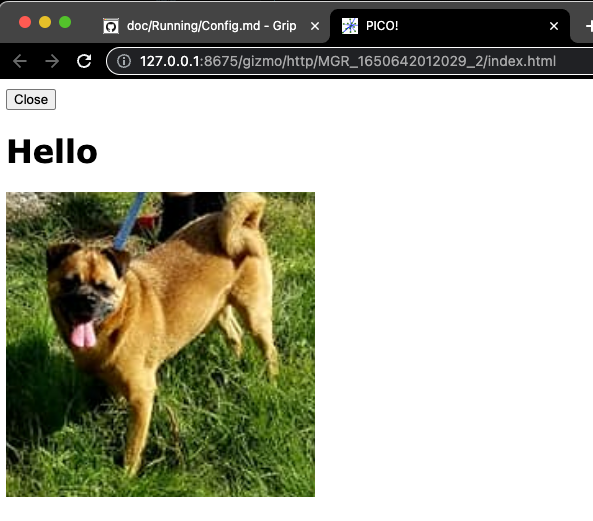

# Gizmo configuratinn

This document describes resource specifications and other configurations
which either must or may be specified before the primary component
is started.

# Static only configurations

The following configurations must be specified before the main component starts.

## Setting the document title

The `component.show`, `component.browse`, and `component.link`
methods accept a keyword `title` argument which specifies the
document title for the browser frame for the gizmo interface.

For example the following script sets the document title to `PICO!'

```python
from H5Gizmos import Html, serve

async def task():
    greeting = Html("<h1>Hello</h1>")
    greeting.serve_folder("local_files", "./example_folder")

    await greeting.show(title="PICO!")

    greeting.add(Html(''))

serve(task())
```

The document title appears in the frame toolbar



## `component.serve_folder`

The `serve_folder` directive configures the Gizmo HTTP server
to recursively serve the files in a folder on the machine running
the parent process.  In the example below the HTTP server serves
the contents of `./example_folder` identified with the URL prefix
`local_files`.

```Python
from H5Gizmos import Html, serve

async def task():
    greeting = Html("<h1>Hello</h1>")
    greeting.serve_folder("local_files", "./example_folder")
    await greeting.show()
    greeting.add(Html(''))

serve(task())
```

The added HTML
```Python
    greeting.add(Html(''))
```
refers to the server relative file `"local_files/dog.png"`
which the server maps to the path `"./example_folder/dog.png"`
in the file system.  The server attempts to assign an appropriate
MIME type to the served file (in this case correctly guessing "img/png").

The gizmo presents the following page including the mapped image:


Served folders are useful for loading related files from complex
Javascript functionality which may combine Javascript modules,
CSS styles, images, and other sorts of data files.

## `component.set_icon`

By default a stand alone gizmo presents a standard icon
in the browser frame list bar.


A script may change the icon using the `set_icon` method.
The script below changes the icon to use the `dog.png` image
shown above.

```Python
from H5Gizmos import Html, serve

async def task():
    greeting = Html("<h1>Hello</h1>")
    greeting.set_icon("./example_folder/dog.png")
    await greeting.show()

serve(task())
```

A run of 
```bash
% python dog_icon.py
```
Displays a small icon with the dog image above the
browser frame


It is also useful to "view source" on the browser frame
to see the icon listed in the static HTML source.
In this case the following line in the listing
specifies the icon:

```html
<link rel="icon" type="image/png" href="./icon.png"/>
```

Clicking on the icon URL in the Chrome browser
source display will show the full size image.

Viewing source can be useful for other static
configurations described here as well.

## `component.remote_css`

The Gizmo infrastructure provides several methods for
loading CSS style sheets statically before the main component
starts.

The `remote_css` method loads a CSS stylesheet from a remote
web server using a fully specified URL.

For example the CSS style at this remote URL includes fancy
styling for buttons
```
https://aaronwatters.github.io/visualization_prototypes/css/base.css
```
The following script uses this style sheet to style a button
```Python
from H5Gizmos import Button, serve

async def task():
    button = Button("Click Me")
    def on_click(*ignored):
        button.add("Hi there! Thanks!")
    button.set_on_click(on_click)
    button.remote_css(
        "https://aaronwatters.github.io/visualization_prototypes/css/base.css"
    )
    await button.show()

serve(task())
```
The resulting gizmo interface shows button text
in all capital letters using a fancy font:


## `component.css_file`

The `css_file` method loads a CSS stylesheet from a file in
the filesystem accessible to the parent process.

The script below loads the CSS stylesheet at the path
`"./css_file_example.css"` before the main component starts.

```Python
from H5Gizmos import Html, serve

async def task():
    greeting = Html("""
    <div>
    <h1>This header should be green</h1>
    But this plain text should be blue.
    </div>
    """)
    greeting.css_file("./css_file_example.css")
    await greeting.show()

serve(task())
```

The content of `"./css_file_example.css"`specifies
colors for text as follows:

```CSS
body {
    color: blue;
}

h1 {
    color: green;
}
```

The stylized gizmo interface looks like this:


The `css_file` method checks that the file
exists and configures the HTTP server to serve the file.

## `component.relative_css`

```Python
from H5Gizmos import Html, serve

async def task():
    greeting = Html("""
    <div>
    <h1>This header should be red</h1>
    But this plain text should be orange.
    </div>
    """)
    greeting.serve_folder("local_files", "./example_folder")
    greeting.relative_css("./local_files/relative_css_example.css")
    await greeting.show()

serve(task())
```

```CSS
body {
    color: orange;
}

h1 {
    color: red;
}
```


The `relative_css` method checks that the
HTTP server is configured to serve the file.


## `component.embedded_css`

The `embedded_css` method injects a string as a CSS style sheet
into the gizmo main page.

If you view source for the browser frame generated by the
following example the text for the stylesheet will appear
in the HTML page specification.

```Python
from H5Gizmos import Html, serve

async def task():
    greeting = Html("""
    <div>
    <h1>This header should be brown</h1>
    But this plain text should be salmon.
    </div>
    """)
    greeting.embedded_css("""
        body {
            color: salmon;
        }
        h1 {
            color: brown;
        }
    """)
    await greeting.show()

serve(task())
```
The gizmo created looks like this:


## `component.insert_html`

The `insert_html` method injects a string as static HTML fragment
appearing above the document location for the main gizmo component.

The following gizmo uses `insert_html` to add some explanatory text
before the main component.

```Python
from H5Gizmos import Html, serve
import time
import asyncio

async def task():
    the_time = Html("<h1>Time here</h1>")
    the_time.insert_html("""
    <h3>A timer.</h3>
    <p>
    The following header will show the current
    time for 60 seconds.
    </p>
    """)
    await the_time.show()
    for i in range(60):
        the_time.text("time is now: " + time.ctime())
        await asyncio.sleep(1)
    the_time.add("Finished!")

serve(task())
```

The resulting gizmo looks like this:


## `component.remote_js`

The Gizmo infrastructure provides
several methods similar to the CSS methods
for loading static javascript modules
before the main component starts.

For example the
<a href="../Tutorials/wavesurfer_poem.md">
Wavesurfer poem tutorial
</a>
loads the wavesurfer module as follows
```Python
...
wavesurfer_js = "https://unpkg.com/wavesurfer.js"
wave = Html("<div>Wavesurfer not yet attached.</div>")
# Load the wavesurfer library in the child javascript context.
wave.remote_js(wavesurfer_js)
...
```
Running `python wavesurfer_poem.py` and viewing the
source of the resulting browser frame reveals the
script tag that corresponds to the `remote_js` method
call:
```html
<script src="https://unpkg.com/wavesurfer.js"></script>
```

## `component.js_file`

The `js_file` method is essentially similar
to `css_file` for javascript code files.  

The following example adds a trivial javascript module
to a gizmo:

```Python
from H5Gizmos import Html, serve

async def task():
    greeting = Html(
        """
        <p>
        Please check the javascript console to see
        the log message issued by the js_file_example.js
        javascript module.
        </p>
        """
    )
    greeting.js_file("./js_file_example.js")
    await greeting.show()

serve(task())
```

The javascript code in `./js_file_example.js` issues this
log message.

```javascript
console.log("js_file reporting for duty!")
```

Running the gizmo and viewing the Javascript console
reveals the following messages.

```
js_file reporting for duty!
index.html:71 gizmo interface initialized
```

Note that the Javascript module is loaded before the gizmo
intitializes.

## `component.relative_js`

The `relative_js` method is essentially similar
to `relative_css` for javascript code files.  

The following example adds a javascript module
from a locally mounted directory:

```Python
from H5Gizmos import Html, serve

async def task():
    greeting = Html(
        """
        <p>
        Please check the javascript console to see
        the log message issued by the example_folder/relative_js_example.js
        javascript module.
        </p>
        """
    )
    greeting.serve_folder("local_files", "./example_folder")
    greeting.relative_js("local_files/relative_js_example.js")
    await greeting.show()

serve(task())
```

Here is the content of the loaded module in `./example_folder/relative_js_example.js`

```javascript
console.log("js_remote reporting for duty!")
```

Running the gizmo and viewing the Javascript console reveals the following messages:

```
js_remote reporting for duty!
index.html:71 gizmo interface initialized
```

## `component.embedded_script`

The `embedded_script` method is essentially similar
to `embedded_css` for javascript code files.  

The following gizmo injects a string as Javascript code
into the Gizmo main HTML page:

```Python
from H5Gizmos import Html, serve

async def task():
    greeting = Html("""
        <p>
        Please check the javascript console to see
        the log message issued by the embedded javascript.
        </p>
    """)
    greeting.embedded_script('console.log("embedded javascript reporting for duty!")')
    await greeting.show()

serve(task())
```

Running the gizmo and viewing the source on the browser frame
reveals the following text embedded in the HTML source:

```html
...
<script>
console.log("embedded javascript reporting for duty!")
</script>
...
```

Viewing the Javascript console reveals the following messages:

```
embedded javascript reporting for duty!
index.html:75 gizmo interface initialized
```

# Static and Dynamic configurations

The following configurations may be specified before or after the main component starts.

## `component.set_title`

The `set_title` method for a component associates a `title` attribute
for the document object generated by the component. HTML title attributes
are used for tooltips and are also used to add additional descriptive
information to be used by screen readers to help people with vision limitations
(among other purposes).

The following example adds a title to the main header component
and also enables stylized tooltips.

```Python
from H5Gizmos import Html, serve

async def task():
    greeting = Html("""
        <h1>
        Hover over this header to see the title
        </h2>
    """)
    greeting.set_title("This is the title for the header.")
    await greeting.show()
    greeting.enable_tooltips()

serve(task())
```

Hovering the mouse over the resulting element reveals the tooltip with
the title.  Without `enable_tooltips` a less fancy tooltip with the
title will appear.


Any visible element can have a title added (not just the main component).

## `component.resize`

The `resize` method sets or changes the width and/or height for an element.

The following gizmo sets a `div` element to be tall and thin.

```Python
from H5Gizmos import Html, serve

async def task():
    greeting = Html("""
        <div>
        A tall thin division area with red text and a yellow background.
        </div>
    """)
    greeting.resize(width=95, height=200)
    greeting.css({"color": "red", "background-color": "yellow"})
    await greeting.show()

serve(task())
```

The resulting gizmo looks like this:


## `component.addClass` and `component.removeClass`

The `addClass` method adds a CSS class to a component and the `removeClass`
removes a CSS class name.

The following script injects some CSS class definitions and uses 
`addClass` and `removeClass` to add them and remove them in a timed
sequence.

```Python
async def task():
    greeting = Html("""
        <h1>
        Warning: This interface is annoying!
        </h1>
    """)
    greeting.embedded_css("""
    .normal {
        color: blue;
        background-color: cornsilk;
    }
    .highlight {
        color: red;
        background-color: yellow;
    }
    """)
    await greeting.show()
    greeting.addClass("normal")
    greeting.add("sleeping 10 seconds")
    await asyncio.sleep(10)
    greeting.add('now highlignting')
    greeting.removeClass("normal")
    greeting.addClass("highlight")

serve(task())
```

When the sequence is complete the interface looks like this:


Note that adding or removing a class name more than once
sometimes doesn't work in our experience.  As shown below
CSS style elements may be changed many times using the `css`
method.

## `component.css`

The `css` method adjusts collections
of CSS style attributes for a component (without using class names).
It supports a keyword based calling sequence
```Python
        greeting.css(color="blue", font="15px Arial, sans-serif")
```
but it also supports a dictionary format because not all CSS style attributes
are legal Python keywords:
```Python
        greeting.css({"background-color": "magenta", "color": "green"})
```

The following example script changes the font color and background
color for a header once a second for a minute:

```Python

from H5Gizmos import Html, serve
import asyncio

async def task():
    greeting = Html("""
        <h1>
        Warning: This interface is also annoying!
        </h1>
    """)
    await greeting.show()
    info = greeting.add("info area placeholder text")
    for i in range(60):
        greeting.css(color="blue")
        greeting.css({"background-color": "yellow"})
        info.text("blue/yellow " + str(i))
        await asyncio.sleep(1)
        greeting.css({"background-color": "magenta", "color": "green"})
        info.text("green/magenta " + str(i))
        await asyncio.sleep(1)
    greeting.add("All done!")

serve(task())
```

The resulting interface looks like this:


## `component.set_on_click`

The `set_on_click` method associates an `on_click` callback with a component
which executes when the user clicks on the component.

The following example associates an click callback to the
primary header component which increments a counter.

```Python
from H5Gizmos import Html, serve

count = 0

async def task():
    greeting = Html("""
        <h1>
        Click this header to add one to the count
        </h2>
    """)
    await greeting.show()
    count_area = greeting.add("count area placeholder text")

    def add_one(*ignored):
        global count
        count += 1
        count_area.text("Count: " + str(count))

    greeting.set_on_click(add_one)

serve(task())
```

The resulting interface looks like this:


The click callback function receives an event argument
which is sometimes useful, but is most often not used.

## `component.add_content`

The `add_content` method configures the gizmo web server
to serve an individual content file.

The following script configures the server to serve
an image file which is then loaded in the HTML for the component.

```Python
from H5Gizmos import Html, serve

async def task():
    greeting = Html("""
        
    """)
    greeting.add_content("example_folder/dog.png")
    await greeting.show()
    info = greeting.add("A dog.")

serve(task())
```

The resulting interface looks like this:


In this case the method inferred the content type `img/png` from
the file name and by default used the filename `dog.png` for the content
URL specification.  It is also possible to specify these parameters
explicitly if appropriate:

```Python
    greeting.add_content("example_folder/dog.png", content_type="img/png", url_path="dog.png")
```

<a href="./README.md">
Return to introduction to running a Gizmo.
</a>
