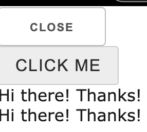
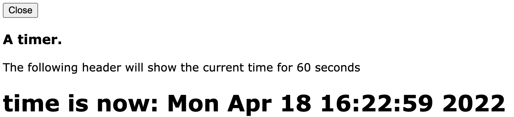
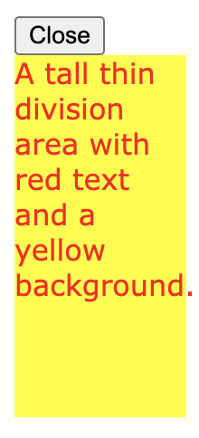
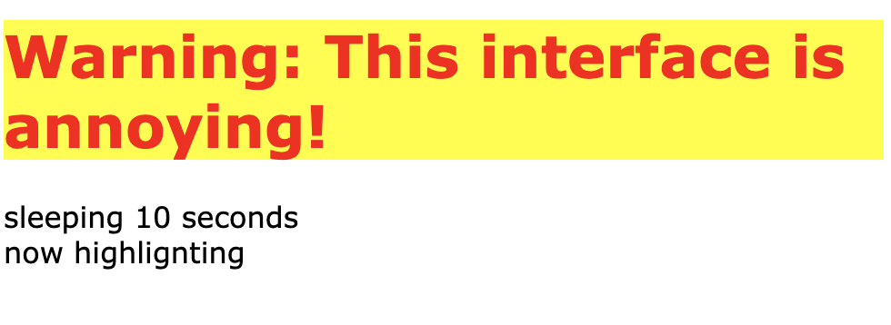
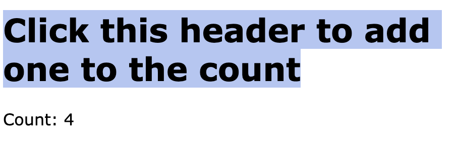
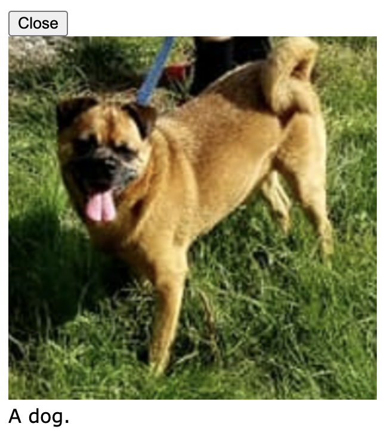

# Gizmo configuratinn

This document describes resource specifications and other configurations
which either must or may be specified before the primary component
is started.

# Static only configurations

The following configurations must be specified before the main component starts.

## `component.serve_folder`

The `serve_folder` directive configures the Gizmo HTTP server
to recursively serve the files in a folder on the machine running
the parent process.  In the example below the HTTP server serves
the contents of `./example_folder` identified with the URL prefix
`local_files`.

```Python
from H5Gizmos import Html, serve

async def task():
    greeting = Html("<h1>Hello</h1>")
    greeting.serve_folder("local_files", "./example_folder")
    await greeting.show()
    greeting.add(Html(''))

serve(task())
```

The added HTML
```Python
    greeting.add(Html(''))
```
refers to the server relative file `"local_files/dog.png"`
which the server maps to the path `"./example_folder/dog.png"`
in the file system.  The server attempts to assign an appropriate
MIME type to the served file (in this case correctly guessing "img/png").

The gizmo presents the following page including the mapped image:


Served folders are useful for loading related files from complex
Javascript functionality which may combine Javascript modules,
CSS styles, images, and other sorts of data files.

## `component.set_icon`

By default a stand alone gizmo presents a standard icon
in the browser frame list bar.


A script may change the icon using the `set_icon` method.
The script below changes the icon to use the `dog.png` image
shown above.

```Python
from H5Gizmos import Html, serve

async def task():
    greeting = Html("<h1>Hello</h1>")
    greeting.set_icon("./example_folder/dog.png")
    await greeting.show()

serve(task())
```

A run of 
```bash
% python dog_icon.py
```
Displays a small icon with the dog image above the
browser frame


It is also useful to "view source" on the browser frame
to see the icon listed in the static HTML source.
In this case the following line in the listing
specifies the icon:

```html
<link rel="icon" type="image/png" href="./icon.png"/>
```

Clicking on the icon URL in the Chrome browser
source display will show the full size image.

Viewing source can be useful for other static
configurations described here as well.

## `component.remote_css`

The Gizmo infrastructure provides several methods for
loading CSS style sheets statically before the main component
starts.

The `remote_css` method loads a CSS stylesheet from a remote
web server using a fully specified URL.

For example the CSS style at this remote URL includes fancy
styling for buttons
```
https://aaronwatters.github.io/visualization_prototypes/css/base.css
```
The following script uses this style sheet to style a button
```Python
from H5Gizmos import Button, serve

async def task():
    button = Button("Click Me")
    def on_click(*ignored):
        button.add("Hi there! Thanks!")
    button.set_on_click(on_click)
    button.remote_css(
        "https://aaronwatters.github.io/visualization_prototypes/css/base.css"
    )
    await button.show()

serve(task())
```
The resulting gizmo interface shows button text
in all capital letters using a fancy font:




## `component.css_file`

The `css_file` method loads a CSS stylesheet from a file in
the filesystem accessible to the parent process.

The script below loads the CSS stylesheet at the path
`"./css_file_example.css"` before the main component starts.

```Python
from H5Gizmos import Html, serve

async def task():
    greeting = Html("""
    <div>
    <h1>This header should be green</h1>
    But this plain text should be blue.
    </div>
    """)
    greeting.css_file("./css_file_example.css")
    await greeting.show()

serve(task())
```

The content of `"./css_file_example.css"`specifies
colors for text as follows:

```CSS
body {
    color: blue;
}

h1 {
    color: green;
}
```

The stylized gizmo interface looks like this:


The `css_file` method checks that the file
exists and configures the HTTP server to serve the file.

## `component.relative_css`

```Python
from H5Gizmos import Html, serve

async def task():
    greeting = Html("""
    <div>
    <h1>This header should be red</h1>
    But this plain text should be orange.
    </div>
    """)
    greeting.serve_folder("local_files", "./example_folder")
    greeting.relative_css("./local_files/relative_css_example.css")
    await greeting.show()

serve(task())
```

```CSS
body {
    color: orange;
}

h1 {
    color: red;
}
```


The `relative_css` method checks that the
HTTP server is configured to serve the file.


## `component.embedded_css`

```Python
from H5Gizmos import Html, serve

async def task():
    greeting = Html("""
    <div>
    <h1>This header should be brown</h1>
    But this plain text should be salmon.
    </div>
    """)
    greeting.embedded_css("""
        body {
            color: salmon;
        }
        h1 {
            color: brown;
        }
    """)
    await greeting.show()

serve(task())
```


## `component.insert_html`

```Python
from H5Gizmos import Html, serve
import time
import asyncio

async def task():
    the_time = Html("<h1>Time here</h1>")
    the_time.insert_html("""
    <h3>A timer.</h3>
    <p>
    The following header will show the current
    time for 60 seconds.
    </p>
    """)
    await the_time.show()
    for i in range(60):
        the_time.text("time is now: " + time.ctime())
        await asyncio.sleep(1)
    the_time.add("Finished!")

serve(task())
```



## `component.remote_js`

The Gizmo infrastructure provides
several methods similar to the CSS methods
for loading static javascript modules
before the main component starts.

For example the
<a href="../Tutorials/wavesurfer_poem.md">
Wavesurfer poem tutorial
</a>
loads the wavesurfer module as follows
```Python
...
wavesurfer_js = "https://unpkg.com/wavesurfer.js"
wave = Html("<div>Wavesurfer not yet attached.</div>")
# Load the wavesurfer library in the child javascript context.
wave.remote_js(wavesurfer_js)
...
```
Running `python wavesurfer_poem.py` and viewing the
source of the resulting browser frame reveals the
script tag that corresponds to the `remote_js` method
call:
```html
<script src="https://unpkg.com/wavesurfer.js"></script>
```

## `component.js_file`

The `js_file` method is essentially similar
to `css_file` for javascript code files.  

```Python
from H5Gizmos import Html, serve

async def task():
    greeting = Html(
        """
        <p>
        Please check the javascript console to see
        the log message issued by the js_file_example.js
        javascript module.
        </p>
        """
    )
    greeting.js_file("./js_file_example.js")
    await greeting.show()

serve(task())
```

```javascript
console.log("js_file reporting for duty!")
```

```
js_file reporting for duty!
index.html:71 gizmo interface initialized
```

## `component.relative_js`

The `relative_js` method is essentially similar
to `relative_css` for javascript code files.  

```Python
from H5Gizmos import Html, serve

async def task():
    greeting = Html(
        """
        <p>
        Please check the javascript console to see
        the log message issued by the example_folder/relative_js_example.js
        javascript module.
        </p>
        """
    )
    greeting.serve_folder("local_files", "./example_folder")
    greeting.relative_js("local_files/relative_js_example.js")
    await greeting.show()

serve(task())
```

```javascript
console.log("js_remote reporting for duty!")
```

```
js_remote reporting for duty!
index.html:71 gizmo interface initialized
```

## `component.embedded_script`

The `embedded_script` method is essentially similar
to `embedded_css` for javascript code files.  

```Python
from H5Gizmos import Html, serve

async def task():
    greeting = Html("""
        <p>
        Please check the javascript console to see
        the log message issued by the embedded javascript.
        </p>
    """)
    greeting.embedded_script('console.log("embedded javascript reporting for duty!")')
    await greeting.show()

serve(task())
```

```html
...
<script>
console.log("embedded javascript reporting for duty!")
</script>
...
```

```
embedded javascript reporting for duty!
index.html:75 gizmo interface initialized
```

# Static and Dynamic configurations

The following configurations may be specified before or after the main component starts.

## `component.set_title`

```Python
from H5Gizmos import Html, serve

async def task():
    greeting = Html("""
        <h1>
        Hover over this header to see the title
        </h2>
    """)
    greeting.set_title("This is the title for the header.")
    await greeting.show()
    greeting.enable_tooltips()

serve(task())
```


## `component.resize`

```Python
from H5Gizmos import Html, serve

async def task():
    greeting = Html("""
        <div>
        A tall thin division area with red text and a yellow background.
        </div>
    """)
    greeting.resize(width=95, height=200)
    greeting.css({"color": "red", "background-color": "yellow"})
    await greeting.show()

serve(task())
```



## `component.addClass` and `component.removeClass`

```Python
async def task():
    greeting = Html("""
        <h1>
        Warning: This interface is annoying!
        </h1>
    """)
    greeting.embedded_css("""
    .normal {
        color: blue;
        background-color: cornsilk;
    }
    .highlight {
        color: red;
        background-color: yellow;
    }
    """)
    await greeting.show()
    greeting.addClass("normal")
    greeting.add("sleeping 10 seconds")
    await asyncio.sleep(10)
    greeting.add('now highlignting')
    greeting.removeClass("normal")
    greeting.addClass("highlight")

serve(task())
```




## `component.css`

```Python

from H5Gizmos import Html, serve
import asyncio

async def task():
    greeting = Html("""
        <h1>
        Warning: This interface is also annoying!
        </h1>
    """)
    await greeting.show()
    info = greeting.add("info area placeholder text")
    for i in range(60):
        greeting.css(color="blue")
        greeting.css({"background-color": "yellow"})
        info.text("blue/yellow " + str(i))
        await asyncio.sleep(1)
        greeting.css(color="green")
        greeting.css({"background-color": "magenta"})
        info.text("green/magenta " + str(i))
        await asyncio.sleep(1)
    greeting.add("All done!")

serve(task())
```


## `component.set_on_click`

```Python
from H5Gizmos import Html, serve

count = 0

async def task():
    greeting = Html("""
        <h1>
        Click this header to add one to the count
        </h2>
    """)
    await greeting.show()
    count_area = greeting.add("count area placeholder text")

    def add_one(*ignored):
        global count
        count += 1
        count_area.text("Count: " + str(count))

    greeting.set_on_click(add_one)

serve(task())
```



## `component.add_content`

```Python
from H5Gizmos import Html, serve

async def task():
    greeting = Html("""
        
    """)
    greeting.add_content("example_folder/dog.png")
    await greeting.show()
    info = greeting.add("A dog.")

serve(task())
```



<a href="./README.md">
Return to introduction to running a Gizmo.
</a>
