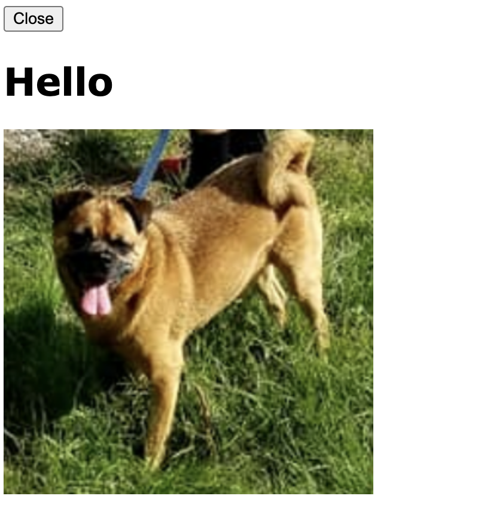

# Gizmo configuratinn

This document describes resource specifications and other configurations
which either must or may be specified before the primary component
is started.

# Static only configurations

The following configurations must be specified before the main component starts.

## `component.serve_folder`

```Python
from H5Gizmos import Html, serve

async def task():
    greeting = Html("<h1>Hello</h1>")
    greeting.serve_folder("local_files", "./example_folder")
    await greeting.show()
    greeting.add(Html(''))

serve(task())
```



## `component.set_icon`

```Python
from H5Gizmos import Html, serve

async def task():
    greeting = Html("<h1>Hello</h1>")
    greeting.set_icon("./example_folder/dog.png")
    await greeting.show()

serve(task())
```


## `component.remote_css`

## `component.css_file`

```Python
from H5Gizmos import Html, serve

async def task():
    greeting = Html("""
    <div>
    <h1>This header should be green</h1>
    But this plain text should be blue.
    </div>
    """)
    greeting.css_file("./css_file_example.css")
    await greeting.show()

serve(task())
```


```CSS
body {
    color: blue;
}

h1 {
    color: green;
}
```


## `component.relative_css`

```Python
from H5Gizmos import Html, serve

async def task():
    greeting = Html("""
    <div>
    <h1>This header should be red</h1>
    But this plain text should be orange.
    </div>
    """)
    greeting.serve_folder("local_files", "./example_folder")
    greeting.relative_css("./local_files/relative_css_example.css")
    await greeting.show()

serve(task())
```

```CSS
body {
    color: orange;
}

h1 {
    color: red;
}
```


## `component.embedded_css`

```Python
from H5Gizmos import Html, serve

async def task():
    greeting = Html("""
    <div>
    <h1>This header should be brown</h1>
    But this plain text should be salmon.
    </div>
    """)
    greeting.embedded_css("""
        body {
            color: salmon;
        }
        h1 {
            color: brown;
        }
    """)
    await greeting.show()

serve(task())
```


## `component.insert_html`

## `component.relative_js`

## `component.embedded_script`

## `component.remote_js`

## `component.js_file`

# Static and Dynamic configurations

The following configurations may be specified before or after the main component starts.

## `component.set_title`

## `component.resize`

## `component.addClass` and `component.removeClass`

## `component.css`

## `component.set_on_click`

## `component.on_timeout`

## `component.add_content`

<a href="./README.md">
Return to introduction to running a Gizmo.
</a>
