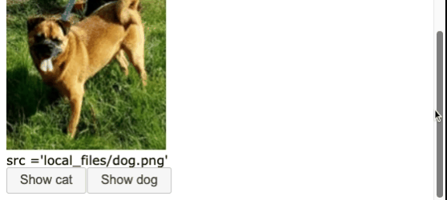
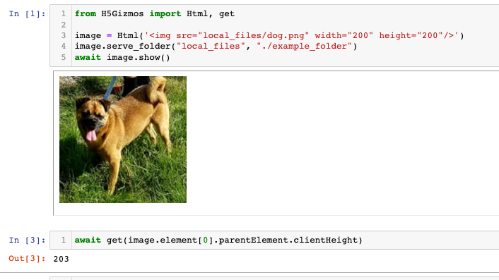
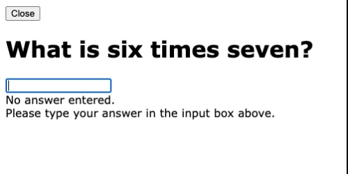
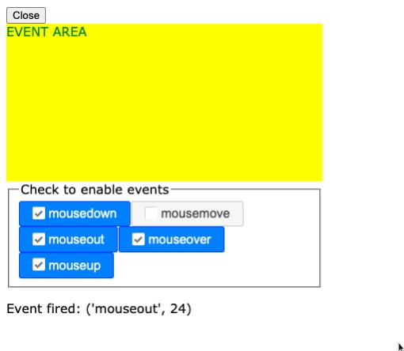
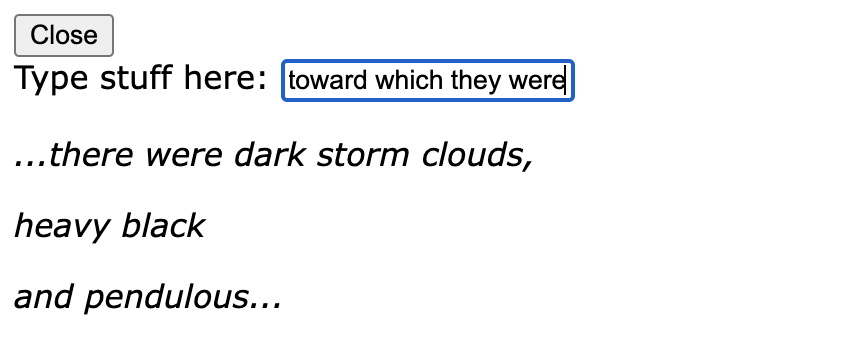
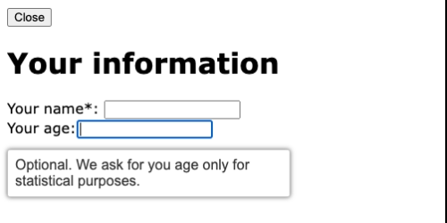
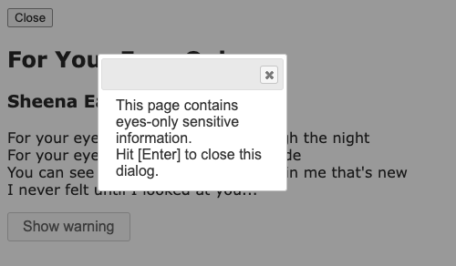
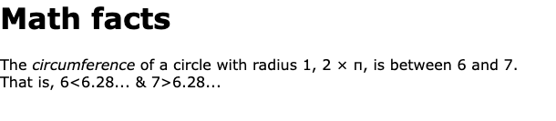
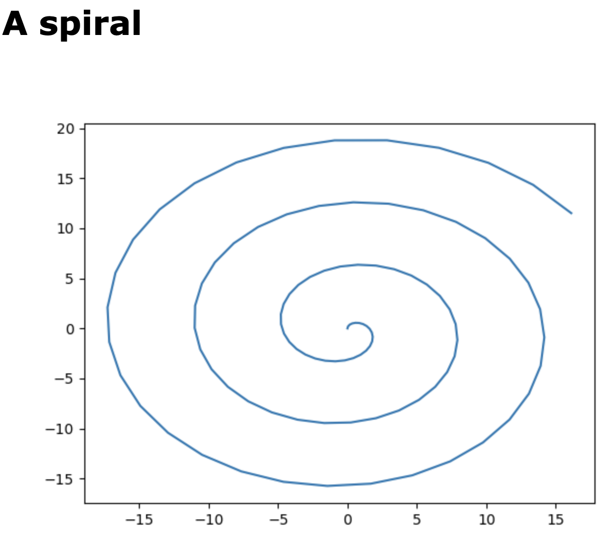

# Gizmo dynamic interactions

This document describes methods for interacting with Gizmo components
after they have started.  The dynamic interactions can be divided into
those that change the parameters of a specific component and those that
change the interface more generally.

# Changing Component Parameters

Some component methods change the way a component responds to events
or the appearance of the component.

## Miscellaneous Document Object and jQuery Methods

Component parameters may be manipulated in many ways by using the Javascript
introspection mapping to access either functionality available from loaded
Javascript libraries or from the HTML document object Javascript interface.
Use the `H5Gizmos.do` function to call a function or method in the child context,
ignoring the return result value, or asynchronously await the `H5Gizmos.get` coroutine to
evaluate an expression in the child context and receive the result value.

The 
<a href="https://jquery.com/">jQuery</a>
and
<a href="https://jqueryui.com/">jQueryUI</a>
libraries are loaded automatically for all components.
These libraries include many generally useful features.
The example script below uses the `attr` core jQuery API method
to change and access an image URL in response to a button click.

```Python
from H5Gizmos import Html, serve, schedule_task, get, do, Button

async def task():
    image = Html('')
    image.serve_folder("local_files", "./example_folder")
    await image.show()
    info = image.add("Put image info here.")

    async def show_image_info_task():
        element = image.element
        src = await get(element.attr("src"))
        info.text("src =" + repr(src))

    def show_cat(*args):
        do(image.element.attr("src", "local_files/cat.jpg"))
        schedule_task(show_image_info_task())

    image.add(Button("Show cat", on_click=show_cat))

    def show_dog(*args):
        do(image.element.attr("src", "local_files/dog.png"))
        schedule_task(show_image_info_task())

    image.add(Button("Show dog", on_click=show_dog))

    schedule_task(show_image_info_task())

serve(task())

```

Here `element = image.element` is a reference to the jQuery container for the image DOM element
in the child Javacript context.  In the `show_image_info_task` coroutine the line

```Python
        src = await get(element.attr("src"))
```
uses the `attr` jQuery method to evaluate the URL associated with the image
and the resulting value is sent from the child to the parent process by the `get` coroutine.
This `await` is in a coroutine because `await` statements are not permitted
outside of coroutines.

In the `show_cat` function the line
```Python
        do(image.element.attr("src", "local_files/cat.jpg"))
```
sets the URL for the image (and ignores the result value, unless there is a Javascipt exception).

The interface generated by the script looks like this:



It is also possible to interact with the internal
DOM object inside the jQuery wrapper
object for the component.  The example below from a Jupyter notebook directly
accesses the `clientHeight` of the `parentElement` for the image DOM element:



Here in the line

```Python
await get(image.element[0].parentElement.clientHeight)
```

The `image.element[0]` expression refers to the Javascript DOM element for the image.
Any 
<a href="https://developer.mozilla.org/en-US/docs/Web/API/Element">method or attribute</a>
of the DOM Element object may be accessed and manipulated in this manner.

# Parameter conveniences

The following methods implement common component parameter configuration actions.

## `component.text` and `component.html`

The `html` and `text` methods both dynamically replace the text
content of a component.  The `text` method "escapes" special characters
to prevent them from being interpreted as HTML formatting and the
`html` method does not.

In the following example the `text` method argument string is not formatted 
as HTML but
the argument string from the `html` method is interpreted as an HTML fragment:

```Python
from H5Gizmos import Html, serve

async def task():
    greeting = Html("<h1>text and html</h1>")
    await greeting.show()

    greeting.add("The next line shows quoted html text.")
    txt = greeting.add("dummy text")
    txt.text("<b><em> Bold and emphasized text </em></b>")

    greeting.add("The next line shows formatted html text.")
    h = greeting.add("dummy text")
    h.html("<b><em> Bold and emphasized text </em></b>")

serve(task())
```
The resulting interface looks like this:


## `component.empty`

The `empty` method removes all content from the 
DOM object associated with the component.

In the example below the script empties the `nag` component when there
is some visible text in the input element.

```python
from H5Gizmos import Html, Input, serve

async def task():
    greeting = Html("<h1>What is six times seven?</h1>")
    await greeting.show()
    answer = Input()
    greeting.add(answer)
    response = greeting.add("No answer entered.")
    nag = greeting.add("Please type your answer in the input box above.")

    def check(*ignored):
        entered = answer.value.strip()
        if entered:
            nag.empty()
            try:
                assert int(entered) == 6 * 7
            except Exception:
                response.text(repr(entered) + " is incorrect.")
            else:
                response.html("<h1>Right!</h1>")
        else:
            nag.html("<em>Pretty please enter your answer in the box above.</em>")

    answer.on_enter(check)

serve(task())
```

The resulting interface looks like this:



## `component.on` and `component.off`

The `on` method for a component associates a callback function
in the parent to be executed when an event of a specific type
fires in the child interface. The `off` method removes any such
callback for a specific event type.

A DOM element may trigger a large number
<a href="https://www.tutorialspoint.com/html5/html5_events.htm">HTML5 event</a> types
and the enumeration and discussion of these events is beyond the scope of this
document.

The example below provides an "event area" target to receive mouse events
and a checkbox group which control which mouse events are enabled or
disabled.

```Python
from H5Gizmos import Html, CheckBoxes, serve

event_count = 0
greeting = Html("<div> EVENT AREA </div>")
greeting.resize(width=400, height=200)
greeting.css({"background-color": "yellow", "color": "green"})

events = "mousedown mousemove mouseout mouseover mouseup".split()

def select_callback(*ignored):
    checked_events = event_selection.selected_values
    for event in events:
        info.text("Checked: " + repr(checked_events))
        greeting.off(event)
        if event in checked_events:
            greeting.on(event, callback=event_callback)

def event_callback(event_info):
    global event_count
    event_count += 1
    event_name = event_info["type"]
    info.text("Event fired: " + repr((event_name, event_count)))

event_selection = CheckBoxes(events, legend="Check to enable events", on_click=select_callback)
info = Html("<p>No events</p>")

async def task():
    await greeting.show()
    greeting.add(event_selection)
    greeting.add(info)
    
serve(task())
```

When an event is enabled and fired by the target element the `info` text
lists the type of event that fired.  The resulting interface looks like this:



## `component.focus`

The focus method requests that a specific component control the
keyboard focus so that that component responds to all keyboard events
until the user explicitly changes the focus or the focus changes for
some other reason.

In the example below the keyboard focus is initially set to the `input`
input area, and after the user enters text in the `input` area
the entered value is cleared and focus returns to the same `input` area
so the user can enter additional text.  Each entered value is added
below on a new line.

```Python
from H5Gizmos import serve, LabelledInput, Html

input = LabelledInput("Type stuff here: ")

def on_text(*ignored):
    txt = input.value
    input.label_container.add(Html("<p><em>%s</em></p>" % txt))
    input.set_value("")
    input.focus()

async def task():
    await input.label_container.show()
    input.on_enter(on_text)
    input.focus()

serve(task())
```

The resulting interface looks like this:



# Other Dynamic interactions

Some component methods change the interface by
enabling a feature or adding a new element to the interface.

## `component.enable_tooltip`

The `enable_tooltip` method enables the 
<a href="https://jqueryui.com/tooltip/">jQueryUI tooltip</a>
feature for the whole interface -- providing a nicely formatted
tooltip for elements with an associated title attribute.

In the example below the title attributes provide additional
information about the two input areas.

```Python
from H5Gizmos import Html, serve, LabelledInput

async def task():
    greeting = Html("<h1>Your information</h1>", title="Please tell us about yourself")
    await greeting.show()
    greeting.enable_tooltips()
    greeting.add(
        LabelledInput("Your name*: ", title="Required field")
        .label_container)
    greeting.add(Html("<br>"))
    greeting.add(
        LabelledInput("Your age:", title="Optional. We ask for you age only for statistical purposes.")
        .label_container)

serve(task())
```

The resulting interface looks like this:



Title elements can also be helpful because they can be read by screen
readers to improve the user experience for people with limited vision.

## `component.add_dialog`, `component.close_dialog`, `component.open_dialog`

The `add_dialog` method creates a 
<a href="https://jqueryui.com/dialog/">
jQueryUI dialog
</a>
which can float above the user interface to provide
alerts or warnings or other information.
The `dialog_options` parameter can configure a dialog
in many different ways -- please consult the jQueryUI documentation
for information on dialog configuration.

In the example below the interface starts with a modal dialog
open which the user must acknowledge by hitting `Enter` or clicking
the dialog close button before the document is visible.

```Python
from H5Gizmos import Html, serve, do, Button

async def task():
    greeting = Html("""
    <div>
        <h2>For Your Eyes Only</h2>
        <h3>Sheena Easton</h3>
        <p>
            For your eyes only, can see me through the night <br>
            For your eyes only, I never need to hide <br>
            You can see so much in me, so much in me that's new <br>
            I never felt until I looked at you...
        </p>
    </div>
    """)
    await greeting.show()
    warning = Html("""
    <div>
        This page contains eyes-only sensitive information.<br>
        Hit [Enter] to close this dialog.
    </div>""")
    options = dict(resizeable=False, height="auto", width=200, modal=True)
    dialog = greeting.add_dialog(warning, dialog_options=options)
    dialog.focus()

    def close_on_enter(event):
        if event["keyCode"] == 13:  # enter key
            dialog.close_dialog()

    do(dialog.element.keypress(close_on_enter), to_depth=1)

    def reopen(*ignored):
        dialog.open_dialog()
        dialog.focus()

    greeting.add(Button("Show warning", on_click=reopen))

serve(task())
```
An `Enter` keypress triggers the `close_dialog` method to close
the dialog and expose the underlying document, and
the interface provides a button to re-open the dialog using
the `open_dialog` method.

The resulting interface looks like this



## `component.add`

The `add` method for a component adds a subordinate component after the component.
The argument to `add` may either be a component object or a text string
which is automatically converted into a `Text` component.

The example below `add`s two subordinate components the the primary `greeting`
component -- the first is a formatted Html object and the second
uses an argument string which is implicitly converted to a `Text`
with HTML special characters quoted.
```Python
from H5Gizmos import Html, serve

async def task():
    greeting = Html("<h1>Math facts</h1>")
    await greeting.show()
    greeting.add(Html("""
    <div>The <em>circumference</em> of a circle with radius 1, 2 &times; &pi;, is between 6 and 7.</div>
    """))
    greeting.add("That is, 6<6.28... & 7>6.28...")

serve(task())
```
The resulting interface looks like this:



## `component.add_pyplot`

The `add_pyplot` method creates and appends a 
`Plotter` component which functions as a context
manager for capturing images from diagrams created using `matplotlib` or libraries based
on `matplotlib`.

The following example plots a simple spiral using `add_pyplot`:

```Python
from H5Gizmos import Html, serve
import numpy as np
import matplotlib.pyplot as plt

T = np.arange(100)
D = T * 0.2
X = D * np.sin(D)
Y = D * np.cos(D)

async def task():
    greeting = Html("<h1>A spiral</h1>")
    await greeting.show()
    plot = greeting.add_pyplot()
    with plot:
        plt.plot(X, Y)

serve(task())
```
The resulting interface looks like this:



Please see the 
<a href="../Tutorials/hello_curves.md">
hello curves
</a> tutorial for a detailed interactive example usage of matplotlib in a Gizmo.

<a href="./README.md">
Return to introduction to running a Gizmo.
</a>