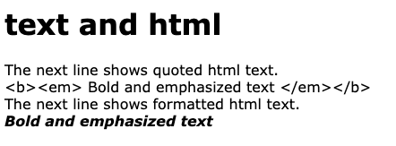

# Gizmo dynamic interactions

This document describes methods for interacting with Gizmo components
after they have started.  The dynamic interactions can be divided into
those that change the parameters of a specific component and those that
change the interface more generally.

# Changing Component Parameters

Some component methods change the way a component responds to events
or appearance of the component.

## Miscellaneous Document Object and jQuery Methods

Component parameters may be manipulated in many ways by using the Javascript
introspection mapping to access either functionality available from loaded
Javascript libraries or from the HTML document object Javascript interface.
Use the `H5Gizmos.do` function to call a function or method in the child context,
ignoring the return result value, or use the `H5Gizmos.get` coroutine to
evaluate an expression in the child context and receive the result value.

The 
<a href="https://jquery.com/">jQuery</a>
and
<a href="https://jqueryui.com/">jQueryUI</a>
libraries are loaded automatically for all components.
These libraries include many generally useful features.
The example script below uses the `attr` core jQuery API method
to change and access an image URL in response to a button click.

```Python
from H5Gizmos import Html, serve, schedule_task, get, do, Button

async def task():
    image = Html('')
    image.serve_folder("local_files", "./example_folder")
    await image.show()
    info = image.add("Put image info here.")

    async def show_image_info_task():
        element = image.element
        src = await get(element.attr("src"))
        info.text("src =" + repr(src))

    def show_cat(*args):
        do(image.element.attr("src", "local_files/cat.jpg"))
        schedule_task(show_image_info_task())

    image.add(Button("Show cat", on_click=show_cat))

    def show_dog(*args):
        do(image.element.attr("src", "local_files/dog.png"))
        schedule_task(show_image_info_task())

    image.add(Button("Show dog", on_click=show_dog))

    schedule_task(show_image_info_task())

serve(task())

```

Here `element = image.element` is a reference to the jQuery container for the image DOM element
in the child Javacript context.  In the `show_image_info_task` coroutine the line

```Python
        src = await get(element.attr("src"))
```
uses the `attr` jQuery method to evaluate the URL associated with the image
and the resulting value is sent from the child to the parent process by the `get` coroutine.

In the `show_cat` function the line
```Python
        do(image.element.attr("src", "local_files/cat.jpg"))
```
sets the URL for the image (and ignores the result value, unless there is a Javascipt exception).

The interface generated by the script looks like this:


It is also possible to interact with the DOM object inside the jQuery wrapper
object for the component.  The example below from a Jupyter notebook directly
accesses the `clientHeight` of the `parentElement` for the image DOM element:


Here in the line

```Python
await get(image.element[0].parentElement.clientHeight)
```

The `image.element[0]` expression refers to the Javascript DOM element for the image.
Any 
<a href="https://developer.mozilla.org/en-US/docs/Web/API/Element">method or attribute</a>
of the DOM Element object may be accessed and manipulated in this manner.

# Parameter conveniences

## `component.text` and `component.html`

The `html` and `text` methods both dynamically replace the text
content of a component.  The `text` method "escapes" special characters
to prevent them from being interpreted as HTML formatting and the
`html` method does not.

In the following example result from the `text` method is not formatted but
the result from the `html` method is formated:

```Python
from H5Gizmos import Html, serve

async def task():
    greeting = Html("<h1>text and html</h1>")
    await greeting.show()

    greeting.add("The next line shows quoted html text.")
    txt = greeting.add("dummy text")
    txt.text("<b><em> Bold and emphasized text </em></b>")

    greeting.add("The next line shows formatted html text.")
    h = greeting.add("dummy text")
    h.html("<b><em> Bold and emphasized text </em></b>")

serve(task())
```
The resulting page looks like this:



## `component.empty`

The `empty` method removes all content from the component.

In the example below the script empties the `nag` component when there
is some visible text in the input element.

```python
from H5Gizmos import Html, Input, serve

async def task():
    greeting = Html("<h1>What is six times seven?</h1>")
    await greeting.show()
    answer = Input()
    greeting.add(answer)
    response = greeting.add("No answer entered.")
    nag = greeting.add("Please type your answer in the input box above.")

    def check(*ignored):
        entered = answer.value.strip()
        if entered:
            nag.empty()
            try:
                assert int(entered) == 6 * 7
            except Exception:
                response.text(repr(entered) + " is incorrect.")
            else:
                response.html("<h1>Right!</h1>")
        else:
            nag.html("<em>Pretty please enter your answer in the box above.</em>")

    answer.on_enter(check)

serve(task())
```


## `component.on` and `component.off`

## `component.focus`

# Other Dynamic interactions

Some component methods change the interface by
enabling a feature or adding a new element to the interface.

## `component.enable_tooltip`

## `component.add_dialog`, `component.close_dialog`, `component.open_dialog`

## `component.add`

## `component.add_pyplot`

## `component.get_info_div`

## `component.shutdown_on_unload`

<a href="./README.md">
Return to introduction to running a Gizmo.
</a>