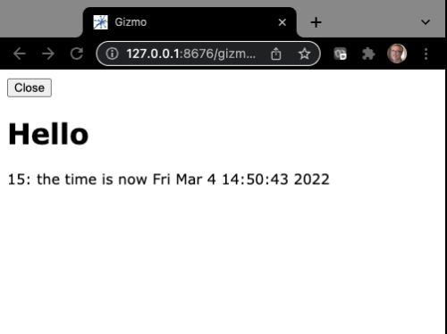

# Tutorial `hello1.py`

The `hello1.py` script displays the current time and updates the display every second.
It demonstrates starting an H5Gizmo interface with two components and updating displayed text.

## The code

```Python
# hello1.py

from H5Gizmos import Html, Text, serve
import asyncio, time

greeting = Html("<h1>Hello</h1>")
the_time = Text("No time like the present")

async def task():
    await greeting.show()
    greeting.add(the_time)
    for i in range(60):
        await asyncio.sleep(1)
        the_time.text("%s: the time is now %s" % (i, time.ctime()))
    the_time.html("<b>Sorry, now I'm tired</b>")

serve(task())
```

## The interface

Run like so:

```bash
% python hello1.py
```

The script opens a new tab in a browser that looks like this.



And the time value updates once a second until a minute has elapsed.


## Discussion

This script creates two components `greeting` and `the_time`.

The HTML interface is created when `serve(task())` schedules `task` for execution.
The `serve` function also starts a number of other internal tasks required for
communicating between the Python parent process and the Javascript child.
The `task` coroutine sets up the `greeting` as the primary component of the interface
using `await greeting.show()` -- and this await does not complete until a Javascript
child context connects to the Python parent via a web socket connection.
Once the child connects the script `add`s `the_time` as a subsidiary component to `greeting`.

The subsequent `for` loop repeatedly waits 1 second and then updates `the_time` to show the current
time.  Note that it is important to use an asynchronous `sleep` because the standard `time.sleep(...)`
would block all asynchronous tasks, preventing communication between the Python parent
and the Javascript child.

The
<a href="hello2.md">hello2</a>
script updates the time in response to a button click instead of updating every second.


<a href="README.md">Return to tutorial list.</a>
