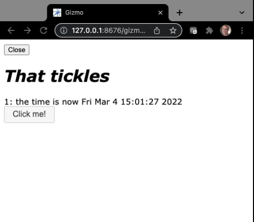

# Tutorial `hello2.py`


The `hello2.py` is similar to 
<a href="hello1.md">
"hello1"</a>
 but updates the time display in response to a button click,
not automatically.

## The code

```Python
# hello2.py

from H5Gizmos import Html, Text, Button, serve
import asyncio, time

greeting = Html("<h1>Hello</h1>")
the_time = Text("No time like the present")
count = 0

def click_callback(*ignored):
    global count
    count += 1
    greeting.html("<em>That tickles</em>")
    the_time.text("%s: the time is now %s" % (count, time.ctime()))

clicker = Button("Click me!", on_click=click_callback)

async def task():
    await greeting.show()
    greeting.add(the_time)
    greeting.add(clicker)

serve(task())
```

## The interface

Run like so:

```bash
% python hello2.py
```

The script opens a new tab in a browser that looks like this.



And the time value updates when the user clicks the "Click me" button.


## Discussion

This script is similar to `hello1.py` except that the user
controls when the time display updates using the `clicker` button.

The `task` coroutine establishes the `greeting` as the primary
component and waits for the Javascript child to connect at
`await greeting.show()`.  After the connection the script
adds the subsidiary components `the_time` and `clicker` 
below `greeting`.
At this point the set up of the for the interface is complete
and the Python process waits for either a "shutdown" or a
"click" event from the Javascript child.

When the user clicks the `clicker` button the `click_callback`
executes, changing the contents of `greeting` and `the_time`.
The callback receives an event argument describing the Javascript
event which triggered the callback, but this information is not
used here.

The 
<a href="hello3.md">hello3</a> is similar to 
hello2
 but the visual components are organized into
a grid using a composite `Stack` component, and some random styling is added.

<a href="README.md">Return to tutorial list.</a>
