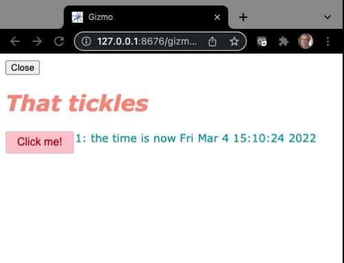

# Tutorial `hello2.py`

The `hello3.py` is similar to 
<a href="hello2.md">hello2</a>
 but the visual components are organized into
a grid using a composite `Stack` component, and some random styling is added.

## The code

```Python
# hello3.py
from H5Gizmos import Html, Text, Button, Stack, serve
import asyncio, time

greeting = Html("<h1>Hello</h1>")
the_time = Text("No time like the present")
count = 0

def click_callback(*ignored):
    global count
    count += 1
    greeting.html("<em>That tickles</em>")
    the_time.text("%s: the time is now %s" % (count, time.ctime()))

clicker = Button("Click me!", on_click=click_callback)

dashboard = Stack([
    greeting,
    [clicker, the_time]
])
dashboard.css({"justify-content": "center"})
greeting.css(color="salmon")
the_time.css(color="darkcyan")
clicker.css({"color": "darkred", "background-color": "pink"})

async def task():
    await dashboard.show()

serve(task())
```

## The interface

Run like so:

```bash
% python hello3.py
```

The script opens a new tab in a browser that looks like this.



And the time value updates when the user clicks the "Click me" button.


## Discussion

This script is similar to `hello2.py` except that the visual components
are organized into a rectangular dashboard using the composite `Stack` component.
Also some colors and other style changes are added to the components.

Here the code
```python
dashboard = Stack([
    greeting,
    [clicker, the_time]
])
```
stacks `greeting` at the top with `clicker` and `the_time` arranged horizontally below
combined into a composite `dashboard` component.
The `task` coroutine then uses the composite `dashboard` as the primary 
component of the interface.

The `greeting.css(color="salmon")` method sets the text color style of the `greeting` to
salmon using a keyword argument convention.
The `dashboard.css({"justify-content": "center"})` uses a dictionary argument
convention for the style because `justify-content` cannot be used as a Python
keyword.

The 
<a href="hello_curves.md">hello_curves</a> script
implements a more complex composite dashboard -- a `Stack` dashboard containing
input sliders which control parameters for a `matplotlib` curve visualization.

<a href="README.md">Return to tutorial list.</a>
