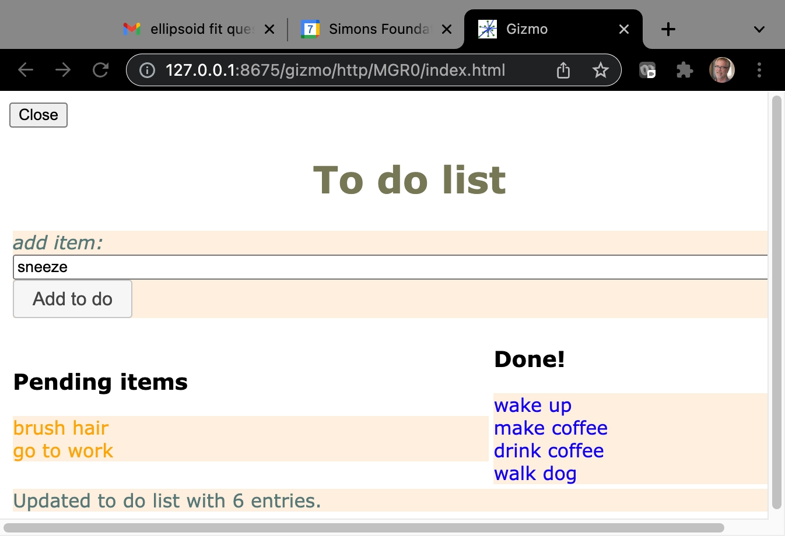

# Tutorial `simple_todo.py`


The `simple_todo.py` script implements a simple "to do list" reminder dashboard.
It illustrates how to style a dashboard using the `Template` composite component
and external CSS style sheets.

This tutorial example is closer to a "real" application than some of the other
tutorial examples.  This discussion will not discuss in detail the following:

- Object oriented structure with a container `TodoList` class which contains `Todo` members.
- Command line usage options with embedded documentaion.
- Simple data persistence of todo list elements to a `JSON` formatted file.

The discussion below explains features more specific to the H5Gizmo platform.

## The code

```Python
"""
A todo list user interface.

Usage:

    python simple_todo.py [url]

If "url" is specified then only the URL for the gizmo is shown
and the URL must be pasted manually into a browser URL bar.  Otherwise
the script will attempt to automatically open a browser window.
"""

from H5Gizmos import Stack, Button, LabelledInput, Text, Html, serve, ClickableText, Template
import json, os

class TodoList:

    def __init__(self, file="./todos.json"):
        self.entries = []
        self.file = file
        if os.path.exists(file):
            with open(file) as f:
                json_entries = json.load(f)
            self.entries = [todo_from_json_object(ob, self) for ob in json_entries]
        self.make_dashboard()

    def make_dashboard(self):
        self.new_item_input = LabelledInput("add item:", size=100).on_enter(self.add_item)
        self.add_button = Button("Add to do").set_on_click(self.add_item)
        self.pending_stack = Stack([], title="Pending items")
        self.done_stack = Stack([], title="Done items")
        self.status_text = Text("Making dashboard.")
        self.dashboard = (
            Template("""
            <table>
                    <tr> <td colspan="2"> <h1>To do list</h1> </td> </tr>
                    <tr> <td colspan="2">
                        <em class="ADD_INPUT"/> <em class="ADD_BUTTON"/>
                    </td></tr>
                    <tr>
                        <td>
                            <h3>Pending items</h3>
                            <div class="PENDING"/>
                        </td>
                        <td>
                            <h3>Done!</h3>
                            <div class="DONE"/>
                        </td>
                    </tr>
                    <tr> <td colspan="2" class="STATUS"/> </tr>
            </table>
            """)
            .put(self.new_item_input.label_container, "ADD_INPUT")
            .put(self.add_button, "ADD_BUTTON")
            .put(self.pending_stack, "PENDING")
            .put(self.done_stack, "DONE")
            .put(self.status_text, "STATUS")
        )
        self.dashboard.css_file("./simple_todo.css")
        self.dashboard.addClass("simple-todo")

    def info(self, message):
        self.status_text.html(message)

    def update_dashboard(self):
        entries = self.entries = [e for e in self.entries if e.status != "deleted"]
        pending = []
        done = []
        for entry in entries:
            if entry.status == "pending":
                pending.append(entry.display())
            else:
                done.append(entry.display())
        for (stack, sequence) in [(self.pending_stack, pending), (self.done_stack, done)]:
            if sequence:
                stack.attach_children(sequence)
            else:
                stack.attach_children(["<em>No entries</em>"])
        with open(self.file, "w") as f:
            json.dump([todo.to_json_object() for todo in self.entries], f)
        self.info("Updated to do list with %s entries." % len(entries))

    def add_item(self, *ignored):
        description = self.new_item_input.value
        if not description:
            return self.info("Please provide a description.")
        self.entries.append(Todo(description, in_list=self))
        self.update_dashboard()
        self.new_item_input.set_value("")

class Todo:

    colors = dict(pending="orange", done="blue", deleted="red")

    def __init__(self, description, status="pending", in_list=None):
        self.description = description
        self.status = status
        self.in_list = in_list

    def display(self):
        return ClickableText(self.description, on_click=self.on_click, color=self.colors[self.status])

    def on_click(self, *ignored):
        next_status = dict(pending="done", done="deleted", deleted="deleted")
        self.status = next_status[self.status]
        if self.in_list:
            self.in_list.update_dashboard()

    def to_json_object(self):
        return dict(status=self.status, description=self.description)

def todo_from_json_object(ob, in_list=None):
    return Todo(ob["description"], ob["status"], in_list)

async def task(link=False):
    todos = TodoList()
    if link:
        await todos.dashboard.link(verbose=True)
    else:
        await todos.dashboard.browse()
    await todos.dashboard.validate_classes()
    todos.update_dashboard()
    todos.new_item_input.focus()

if __name__ == "__main__":
    expected = "url"
    try:
        import sys
        argv = sys.argv
        ln = len(sys.argv)
        if ln > 1:
            assert argv[1] == expected, "Please only use %s or no argument." % repr(expected)
            assert ln == 2, "Too many arguments -- ony %s is supported." % repr(expected)
            serve(task(link=True))
        else:
            serve(task(link=False))
    except (Exception, KeyboardInterrupt):
        print(__doc__)
        raise
```

## The interface

Run like so:

```bash
% python simple_todo.py
```

The script opens a new tab in a browser that looks like this.




## Discussion

This example reiterates a number of features described in the other tutorials:

- Gizmo start up.
- `Button` event callbacks.
- Simple composite components like `Stack`.
- Dynamic changes to displayed content.

### The `dashboard` `Template`

The `Template` composite component is designed to allow dynamic components
to be placed inside an arbitrary HTML design layout.

The gizmo uses a `Template` to allow components of the `dashboard` to be "mounted" into
a somewhat complex HTML table structure.  For example in
```Python
        self.dashboard = (
            Template("""
            ...
                            <div class="PENDING"/>
            ...
            """)
            ...
            .put(self.pending_stack, "PENDING")
            ....
        )
```
the `PENDING` `div` element is a "placeholder mount point" and the `put` operation appends
the `pending_stack` component at that position.

### CSS styling using external style sheets

This example also illustrates how to use external CSS style sheets to
specify the look of gizmo components.

The declaration
```Python
        self.dashboard.css_file("./simple_todo.css")
```
loads the local file `./simple_todo.css` in the gizmo startup page.  This file defines
styling for the CSS class `simple-todo`.
The gizmo attaches this class to the `self.dashboard` primary component using the
`addClass` method.
```Python
        self.dashboard.addClass("simple-todo")
```

### Changing members of composite components

The `update_dashboard` method changes this displayed lists of `Todo` items
when user actions add, move, or delete a `Todo` from the `TodoList`.  The
`TodoList.update_dashboard` method changes the displayed lists using the
`Stack.attach_children` method:
```Python

    def update_dashboard(self):
        ...
        for (stack, sequence) in [(self.pending_stack, pending), (self.done_stack, done)]:
            if sequence:
                stack.attach_children(sequence)
            else:
                stack.attach_children(["<em>No entries</em>"])
        ...
```
This action discards and replaces the `Stack` children in the HTML document model.

<a href="README.md">Return to tutorial list.</a>
