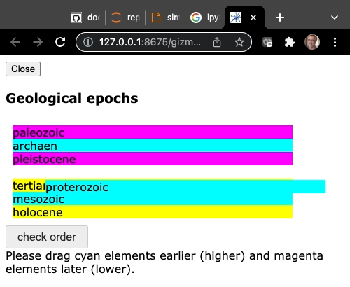

# Tutorial `sortable_epochs.py`

The `sortable_epochs.py` script asks the user to drag geological epochs into the correct
time order.  It illustrates how to use ad-hoc Javascript in a Gizmo implementation and
how to get a value from the Javascript child process transferred to the parent process.

## The code

```Python
# sortable_epochs.py

from H5Gizmos import Html, Stack, Text, Button, do, get, serve, schedule_task

epoch_order = "archaen proterozoic paleozoic mesozoic tertiary pleistocene holocene".split()
bogus_order = "paleozoic holocene archaen proterozoic pleistocene tertiary mesozoic".split()

epochs = {name: Text(name) for name in epoch_order}
children = [epochs[name] for name in bogus_order]

sorter = Stack(children)
sorter.resize(width=400)
sorter.css(padding="10px")
info = Text("Drag the epochs to order them oldest (higher) to youngest (lower).")

async def task():
    Header = Html("<h3>Geological epochs</h3>")
    await Header.show()
    Header.add(sorter)
    do(sorter.element.sortable())
    sorter.js_init("""
        element.child_order = function () {
            var children = Array.from(element[0].children)
            result = children.map(x => x.textContent);
            return result;
        };
        """)
    def check_click(*ignored):
        schedule_task(check_task())
    Header.add(Button("check order", on_click=check_click))
    Header.add(info)

async def check_task():
    info.html("Please drag cyan elements earlier (higher) and magenta elements later (lower).")
    order = await get(sorter.element.child_order())
    correct = True
    for (index, epoch_name) in enumerate(order):
        correct_index = epoch_order.index(epoch_name)
        color = "yellow"
        if correct_index < index:
            color = "cyan"
            correct = False
        if correct_index > index:
            color = "magenta"
            correct = False
        epochs[epoch_name].css({"background-color": color})
    if correct:
        info.html("All correct!")

serve(task())
```

## The interface

Run like so:

```bash
% python sortable_epochs.py
```

The script opens a new tab in a browser that looks like this.




## Discussion


<a href="README.md">Return to tutorial list.</a>
