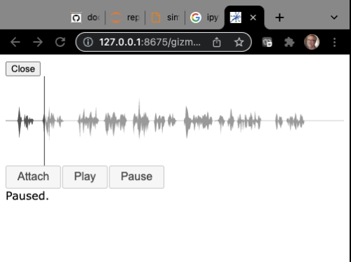

# Tutorial `wavesurfer_poem.py`

The `wavesurfer_poem.py` script controls an audio player implemented using
an external Javascript library.  It demonstrates how to load Javascript functionality
for a gizmo and how to attach external resources to a gizmo.

This gizmo creates an interactive audio wave diagram of a poem recital
and plays the poem audio after the user attaches the audio and clicks the play button.

## The code

```Python
# wavesurfer_poem.py

from H5Gizmos import Html, Text, Button, Stack, serve, do

# Here is a local audio data file we want to load
poem_path = "./song_cjrg_teasdale_64kb.mp3"
# We associate the audio data with this local URL.
poem_url = "poem.mp3"
# This is the remote javascript library URL for the wavesurfer player implementation.
wavesurfer_js = "https://unpkg.com/wavesurfer.js"

wave = Html("<div>Wavesurfer not yet attached.</div>")
# Load the wavesurfer library in the child javascript context.
wave.remote_js(wavesurfer_js)
# Associate the poem audio with the poem_url.
wave.add_content(poem_path, "audio/mpeg", poem_url)

Attach_button = Button("Attach")
Play_button = Button("Play")
Pause_button = Button("Pause")

info = Text("This is the info area for the dashboard.")

def on_ready(*ignored):
    "When the player is ready enable the play and pause buttons."
    Play_button.set_on_click(play)
    Pause_button.set_on_click(pause)
    info.text("Audio is loaded and ready.")

def attach(*ignored):
    wave.js_init("""
        // THIS IS INJECTED JAVASCRIPT CODE
        
        // Clear the JQuery element associated with the gizmo component:
        element.empty();

        // Create and store the WaveSurfer visualization
        element.wavesurfer = WaveSurfer.create({
            // Attach the visualization to the DOM element for the component,
            container: element[0]
        });

        // Load the audio file.
        element.wavesurfer.load(url);

    """, url=poem_url) 

    # when the wavesurfer player is ready call the on_ready callback.
    do(wave.element.wavesurfer.on("ready", on_ready))
    info.text("Attached: audio.")

Attach_button.set_on_click(attach)

def pause(*ignored):
    do(wave.element.wavesurfer.pause())
    info.text("Paused.")

def play(*ignored):
    do(wave.element.wavesurfer.play())
    info.text("Playing.")

Dashboard = Stack([
    wave,
    [Attach_button, Play_button, Pause_button],
    info
])

async def task():
    await Dashboard.show()

serve(task())
```

## The interface

Run like so:

```bash
% python wavesurfer_poem.py
```

The script opens a new tab in a browser that looks like this.



## Discussion

This script mimicks <a href="hello_curves.md">hello_curves</a> 
by creating a composite `Stack` dashboard with interactive controls
and starting the dashboard interface.  

The implementation for the
audio player is defined in remote Javascript code and the audio
data to play must be loaded by the player via standard web protocols.

The `wavesurfer` audio player is implemented in a javascript package
```Python
wavesurfer_js = "https://unpkg.com/wavesurfer.js"
```
The `remote_js` declaration
```Python
wave.remote_js(wavesurfer_js)
```
configures the gizmo to load the `wavesurfer.js` code when the gizmo starts.

The audio data file is stored in the file system and mapped as an HTTP
GET resource with MIME type "audio/mpeg" for the gizmo server using the `add_content` method.
```Python
# Here is the path to the local audio data file we want to load
poem_path = "./song_cjrg_teasdale_64kb.mp3"
# We associate the audio data with this local URL.
poem_url = "poem.mp3"
...
# Associate the poem audio with the poem_url.
wave.add_content(poem_path, "audio/mpeg", poem_url)
```

The `attach` operation injects Javascript to configure the audio
control using the `WaveSurfer` javascript function defined 
in the remote script `"https://unpkg.com/wavesurfer.js"`
```Python
def attach(*ignored):
    wave.js_init("""
        // THIS IS INJECTED JAVASCRIPT CODE
        
        // Clear the JQuery element associated with the gizmo component:
        element.empty();

        // Create and store the WaveSurfer visualization
        element.wavesurfer = WaveSurfer.create({
            // Attach the visualization to the DOM element for the component,
            container: element[0]
        });

        // Load the audio file.
        element.wavesurfer.load(url);

    """, url=poem_url) 
```
Here the `js_init` keyword argument `url=poem_url` maps into the Javascript
name space and is used to load the audio data
```Javascript
        // Load the audio file.
        element.wavesurfer.load(url);
```

The `pause` and `play` button click callback functions invoke
methods of the `wavesurfer` player object in the child Javascript
context using the `do` method as described in 
<a href="sortable_epochs.md">the sortable_epochs tutorial</a>. For example:
```Python
def pause(*ignored):
    do(wave.element.wavesurfer.pause())
    info.text("Paused.")
```

<a href="README.md">Return to tutorial list.</a>
