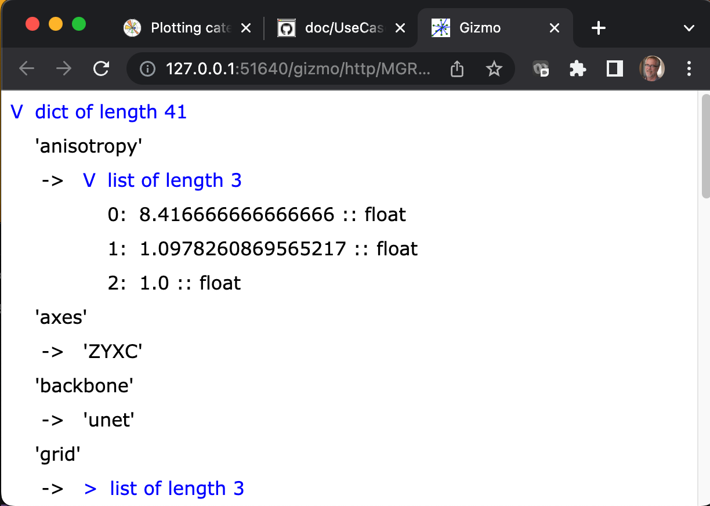

# Exploring a JSON encoded data structure use case

<a href="https://www.json.org/json-en.html">
Javascript Object Notation (JSON)
</a> provides a popular and convenient way to store
and transfer loosely typed structured data.

The H5Gizmos package includes a tool `json_gizmo` for exploring JSON
encoded data structures stored in files.
For example the following interaction parses a JSON file generated
by a machine learning tool.

```
$ json_gizmo config.json 
attempting to parse JSON in 'config.json'

Open gizmo using link (control-click / open link)

<a href="http://127.0.0.1:51640/gizmo/http/MGR_1683735415077_2/index.html" target="_blank">Click to open</a> <br> 
 GIZMO_LINK: http://127.0.0.1:51640/gizmo/http/MGR_1683735415077_2/index.html 
```

Openning the `http` link launches a web interface for exploring the
structure of the JSON data.



Expand or collapse structures in the interface by clicking on the blue
text links.

<a href="README.md">Return to the use case list.</a>
