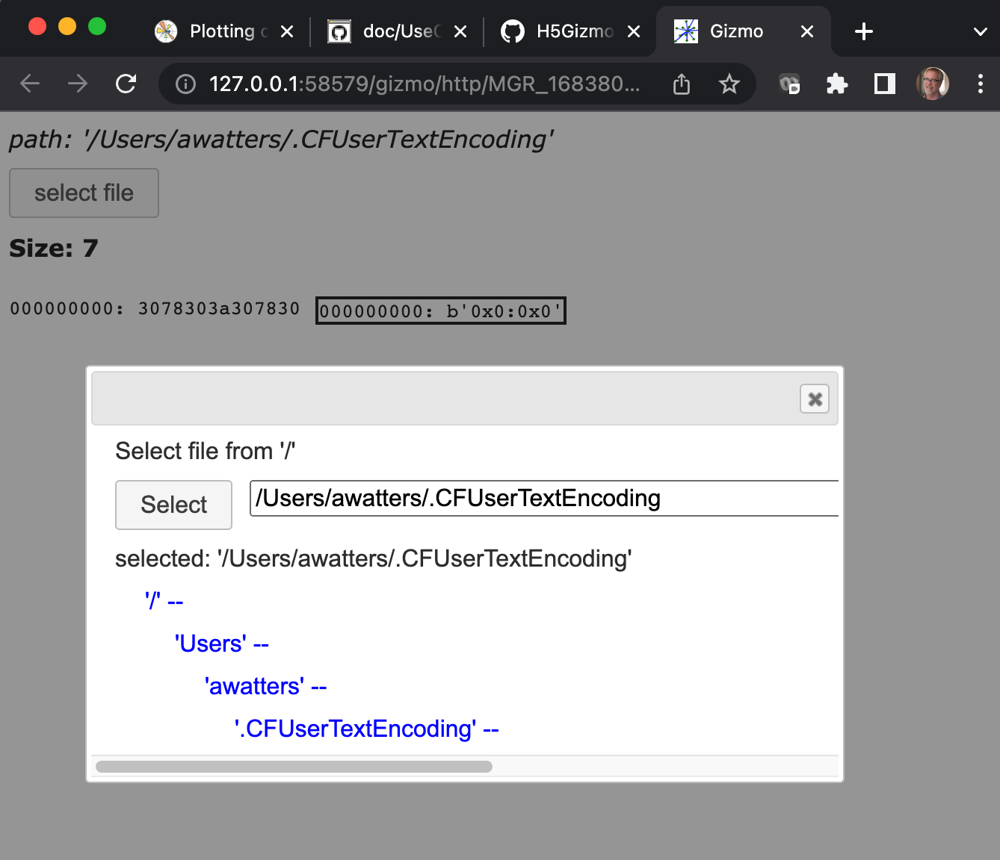

# Viewing a matplotlib plot on a remote machine use case

The `H5Gizmos` package includes a script which allows the user
to interactively select a file from the file system and view the
binary content of the file.  Start the script using this command line:

```
% gizmo_script H5Gizmos/show_binary
```

The user interface for the script initially starts with no file selected.



The user opens a file selection dialog by pressing the "select file" button
and then navigates in the dialog to a file of interest.  The "Select" button
in the dialog opens the file and shows the binary content of the first
2000 bytes of the file in both hexidecimal and ASCII-byte encoding.


<a href="README.md">Return to the use case list.</a>
