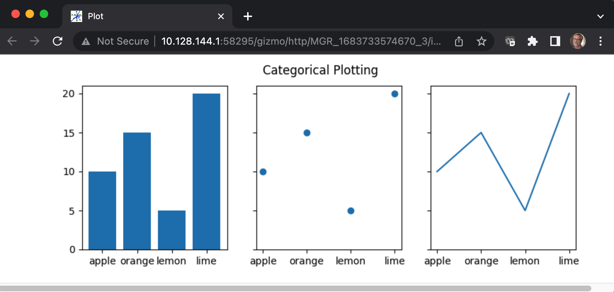

# Viewing a matplotlib plot on a remote machine use case

This document describes a use case which addresses a
situation that often occurs in scientific computing.  Here
at the Flatiron Institute we process scientific datasets on
"supercomputer" compute clusters.  It is often useful to view
charts or graphs based on these datasets, but it can be cumbersome
to view the plots.

Typically a researcher works with a personal device such as a
Mac laptop and uses tools such as "secure shell" `ssh` to access
the cluster processors.  Plotting tools such as 
<a href="https://matplotlib.org/">matplotlib</a> will not
display graphical plots when run on the compute cluster without some sort of special
configuration.  For example the following
<a href="https://matplotlib.org/stable/gallery/lines_bars_and_markers/categorical_variables.html#sphx-glr-gallery-lines-bars-and-markers-categorical-variables-py">
Categorical plot example</a> will silently do nothing if run from a `ssh`
console without special configuration.

```Python
import matplotlib.pyplot as plt

data = {'apple': 10, 'orange': 15, 'lemon': 5, 'lime': 20}
names = list(data.keys())
values = list(data.values())

fig, axs = plt.subplots(1, 3, figsize=(9, 3), sharey=True)
axs[0].bar(names, values)
axs[1].scatter(names, values)
axs[2].plot(names, values)
fig.suptitle('Categorical Plotting')
plt.show()
```

The H5Gizmos package includes a simple convenience function
`show_matplotlib_plt()` which can replace `plt.show()` above.
This allows the plot to be generated on the compute cluster
and viewed using a URL link on the
researchers personal laptop.

The modified script replaces `plt.show()` with two lines:
```Python
...
from H5Gizmos import show_matplotlib_plt
show_matplotlib_plt()
```
So the 
<a href="./categorical.py">
categorical.py script</a>
looks like this:
```Python
import matplotlib.pyplot as plt

data = {'apple': 10, 'orange': 15, 'lemon': 5, 'lime': 20}
names = list(data.keys())
values = list(data.values())

fig, axs = plt.subplots(1, 3, figsize=(9, 3), sharey=True)
axs[0].bar(names, values)
axs[1].scatter(names, values)
axs[2].plot(names, values)
fig.suptitle('Categorical Plotting')
#plt.show()

from H5Gizmos import show_matplotlib_plt
show_matplotlib_plt()
```
When run on a compute cluster node the script prints something similar to the following
```bash
(base) HP07M20G6J:UseCases awatters$ ssh rusty
No Slurm jobs found on node.
[awatters@rusty1 ~]$ python categorical.py 

Open gizmo using link (control-click / open link)

<a href="http://10.128.144.1:58295/gizmo/http/MGR_1683733574670_3/index.html" target="_blank">Click to open</a> <br> 
 GIZMO_LINK: http://10.128.144.1:58295/gizmo/http/MGR_1683733574670_3/index.html 
```
Openning the `http` link in a browser displays the categorical plot.



This method will plot other matplotlib-based plots such as those generated by
<a href="https://seaborn.pydata.org/index.html">
seaborn.</a>
For example the 
<a href="seaborn_histogram.py">seaborn_histogram.py</a>
script generates the 
<a href="https://seaborn.pydata.org/examples/histogram_stacked.html">
Stacked histogram example from the seaborn gallery.</a>

<a href="README.md">Return to the use case list.</a>
